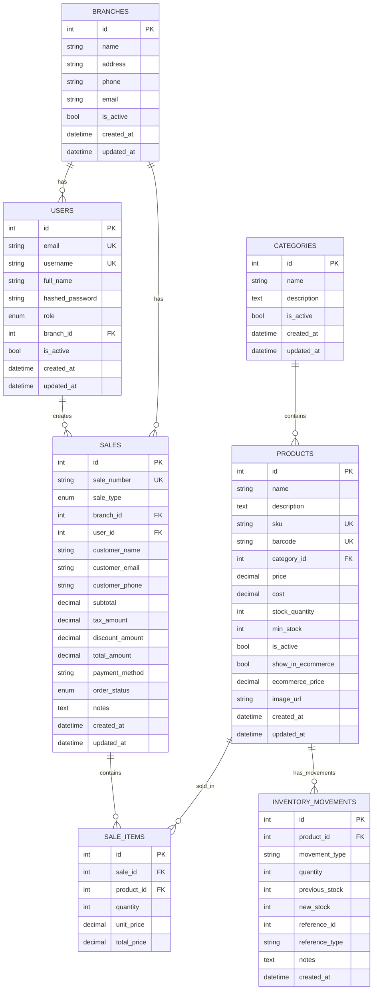
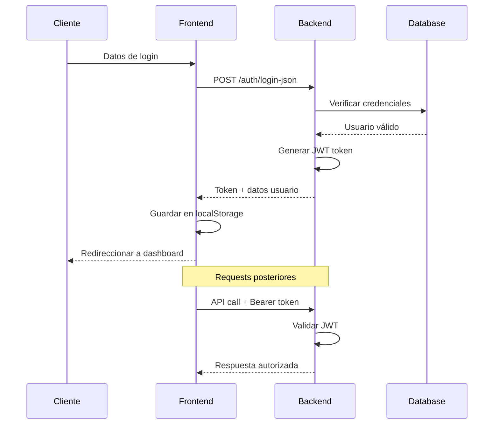
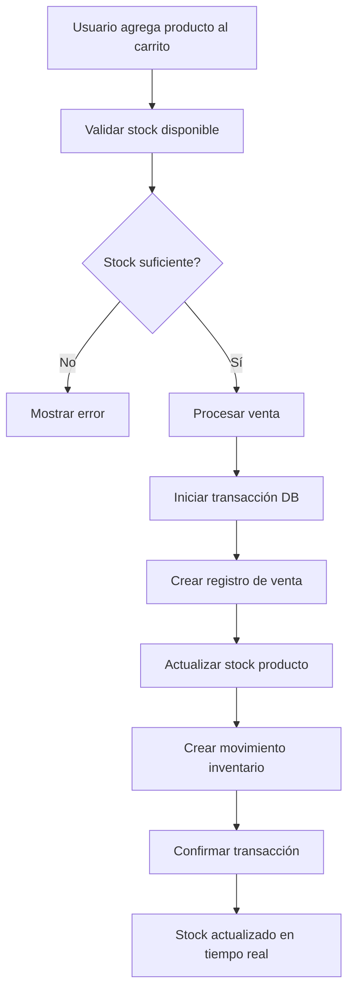

# 🏗️ Arquitectura del Sistema POS Cesariel

## 📋 Tabla de Contenido
- [Arquitectura General](#arquitectura-general)
- [Stack Tecnológico](#stack-tecnológico)
- [Arquitectura del Backend](#arquitectura-del-backend)
- [Arquitectura del Frontend](#arquitectura-del-frontend)
- [Base de Datos](#base-de-datos)
- [Comunicación entre Servicios](#comunicación-entre-servicios)
- [Containerización](#containerización)
- [Patrones de Diseño](#patrones-de-diseño)
- [Seguridad](#seguridad)
- [Escalabilidad](#escalabilidad)

---

## 🏗️ Arquitectura General

### Patrón Arquitectónico
El sistema POS Cesariel implementa una **arquitectura de microservicios en capas** con separación clara de responsabilidades:

```
┌─────────────────┐    ┌─────────────────┐    ┌─────────────────┐
│   📱 Frontend   │◄──►│   🔧 Backend    │◄──►│   🗄️ Database  │
│   (Next.js)     │    │   (FastAPI)     │    │ (PostgreSQL)   │
└─────────────────┘    └─────────────────┘    └─────────────────┘
         │                       │                       │
         └───────────────────────┼───────────────────────┘
                                 ▼
                    ┌─────────────────┐
                    │   🔧 Adminer    │
                    │ (DB Management) │
                    └─────────────────┘
```

### Componentes Principales

1. **Capa de Presentación** (Frontend)
   - Interfaz de usuario responsiva
   - Gestión de estado de la aplicación
   - Comunicación con APIs

2. **Capa de Lógica de Negocio** (Backend)
   - APIs REST
   - Autenticación y autorización
   - Lógica de negocio del POS

3. **Capa de Datos** (Database)
   - Persistencia de datos
   - Integridad referencial
   - Optimización de consultas

4. **Herramientas de Desarrollo**
   - Administración de BD
   - Monitoreo y logs

---

## 💻 Stack Tecnológico

### Frontend
| Tecnología | Versión | Propósito |
|------------|---------|-----------|
| **Next.js** | 15.3.5 | Framework React con SSR/SSG |
| **React** | 19.0.0 | Biblioteca de UI |
| **TypeScript** | ^5.0 | Tipado estático |
| **TailwindCSS** | ^4.0 | Estilos y diseño responsivo |
| **Zustand** | ^4.4.6 | Gestión de estado |
| **Axios** | ^1.6.0 | Cliente HTTP |
| **React Hook Form** | ^7.48.2 | Manejo de formularios |
| **Heroicons** | ^2.0.18 | Iconografía |
| **React Hot Toast** | ^2.4.1 | Notificaciones |

### Backend
| Tecnología | Versión | Propósito |
|------------|---------|-----------|
| **FastAPI** | 0.115.14 | Framework web moderno |
| **Python** | 3.9+ | Lenguaje de programación |
| **SQLAlchemy** | 2.0.36 | ORM para base de datos |
| **Pydantic** | 2.11.7 | Validación de datos |
| **Uvicorn** | 0.35.0 | Servidor ASGI |
| **PostgreSQL** | psycopg2-binary 2.9.9 | Driver de base de datos |
| **Alembic** | 1.13.3 | Migraciones de BD |
| **python-jose** | 3.3.0 | JWT token handling |
| **passlib** | 1.7.4 | Hash de contraseñas |

### Base de Datos
| Tecnología | Versión | Propósito |
|------------|---------|-----------|
| **PostgreSQL** | 15 | Base de datos relacional |
| **Adminer** | latest | Administración web de BD |

### DevOps y Containerización
| Tecnología | Versión | Propósito |
|------------|---------|-----------|
| **Docker** | latest | Containerización |
| **Docker Compose** | 3.8 | Orquestación de servicios |

---

## 🔧 Arquitectura del Backend

### Estructura Modular

```
backend/
├── main.py              # Punto de entrada de la aplicación
├── database.py          # Configuración de base de datos
├── models.py            # Modelos SQLAlchemy
├── schemas.py           # Esquemas Pydantic
├── auth.py              # Sistema de autenticación
├── init_data.py         # Inicialización de datos
├── routers/             # Endpoints organizados por dominio
│   ├── __init__.py
│   ├── auth.py          # Autenticación
│   ├── branches.py      # Gestión de sucursales
│   ├── users.py         # Gestión de usuarios
│   ├── categories.py    # Categorías de productos
│   ├── products.py      # Gestión de inventario
│   └── sales.py         # Sistema de ventas
├── Dockerfile           # Imagen Docker
└── requirements.txt     # Dependencias Python
```

### Capas de la Aplicación

#### 1. **Capa de Entrada (Entry Layer)**
```python
# main.py - Configuración de FastAPI
app = FastAPI(
    title="Backend POS Cesariel",
    description="API para el sistema de punto de venta multisucursal",
    version="1.0.0"
)

# Middleware de CORS
app.add_middleware(CORSMiddleware, ...)

# Inclusión de routers
app.include_router(auth.router)
app.include_router(products.router)
# ... otros routers
```

#### 2. **Capa de Rutas (Router Layer)**
```python
# routers/products.py
router = APIRouter(prefix="/products", tags=["products"])

@router.get("/", response_model=List[ProductSchema])
async def get_products(
    current_user: User = Depends(get_current_active_user),
    db: Session = Depends(get_db)
):
    # Lógica del endpoint
```

#### 3. **Capa de Autenticación y Autorización**
```python
# auth.py
def get_current_user(credentials: HTTPAuthorizationCredentials = Depends(security)):
    # Validación JWT
    
def require_role(allowed_roles: list[UserRole]):
    # Decorador de autorización por roles
```

#### 4. **Capa de Modelos (Data Layer)**
```python
# models.py - Modelos SQLAlchemy
class Product(Base):
    __tablename__ = "products"
    
    id = Column(Integer, primary_key=True)
    name = Column(String(200), nullable=False)
    # ... otros campos
```

#### 5. **Capa de Validación (Schema Layer)**
```python
# schemas.py - Esquemas Pydantic
class ProductCreate(BaseModel):
    name: str
    price: Decimal
    # Validaciones automáticas
```

### Principios Implementados

- **Separación de Responsabilidades**: Cada módulo tiene una función específica
- **Dependency Injection**: FastAPI maneja automáticamente las dependencias
- **Type Safety**: Uso extensivo de typing y Pydantic
- **API First**: Documentación automática con OpenAPI/Swagger

---

## 📱 Arquitectura del Frontend

### Estructura de Directorios

```
frontend/pos-cesariel/
├── app/                 # App Router (Next.js 15)
│   ├── layout.tsx       # Layout principal
│   ├── page.tsx         # Página de inicio
│   ├── login/           # Módulo de autenticación
│   │   └── page.tsx
│   ├── dashboard/       # Dashboard principal
│   │   └── page.tsx
│   └── pos/             # Módulo POS-Ventas
│       └── page.tsx
├── components/          # Componentes reutilizables
│   └── Layout.tsx       # Layout con sidebar
├── lib/                 # Utilidades y configuración
│   ├── api.ts           # Cliente API con Axios
│   └── auth.ts          # Gestión de autenticación
├── middleware.ts        # Middleware de Next.js
├── package.json         # Dependencias
└── tsconfig.json        # Configuración TypeScript
```

### Arquitectura de Componentes

#### 1. **App Router Structure** (Next.js 15)
```typescript
// app/layout.tsx - Layout principal
export default function RootLayout({
  children,
}: {
  children: React.ReactNode
}) {
  return (
    <html lang="es">
      <body>
        {children}
        <Toaster position="top-right" />
      </body>
    </html>
  )
}
```

#### 2. **Gestión de Estado con Zustand**
```typescript
// lib/auth.ts
interface AuthState {
  user: User | null;
  token: string | null;
  isAuthenticated: boolean;
  login: (token: string, user: User) => void;
  logout: () => void;
}

export const useAuth = create<AuthState>()(persist(...))
```

#### 3. **Cliente API con Interceptores**
```typescript
// lib/api.ts
export const api = axios.create({
  baseURL: 'http://localhost:8000',
});

// Interceptor para JWT
api.interceptors.request.use((config) => {
  const token = localStorage.getItem('token');
  if (token) {
    config.headers.Authorization = `Bearer ${token}`;
  }
  return config;
});
```

#### 4. **Protección de Rutas**
```typescript
// middleware.ts
export function middleware(request: NextRequest) {
  const token = request.cookies.get('auth-token')?.value;
  
  if (!token && !publicRoutes.includes(pathname)) {
    return NextResponse.redirect(new URL('/login', request.url));
  }
}
```

### Patrones de Frontend

- **Component Composition**: Componentes modulares y reutilizables
- **Custom Hooks**: Lógica reutilizable encapsulada
- **API Layer**: Abstracción de llamadas HTTP
- **State Management**: Estado global con Zustand
- **Type Safety**: TypeScript en toda la aplicación

---

## 🗄️ Base de Datos

### Esquema Relacional



### Entidades Principales

#### 1. **Branches (Sucursales)**
- Gestión multisucursal
- Cada usuario pertenece a una sucursal
- Filtros de datos por sucursal

#### 2. **Users (Usuarios)**
- Sistema de roles: Admin, Manager, Seller, E-commerce
- Autenticación JWT
- Permisos granulares

#### 3. **Products (Productos)**
- Inventario centralizado
- Códigos SKU y barcode únicos
- Precios diferenciados para e-commerce
- Control de stock en tiempo real

#### 4. **Sales (Ventas)**
- Ventas unificadas POS y E-commerce
- Estados de pedido para e-commerce
- Números de venta únicos autogenerados

#### 5. **Inventory Movements (Movimientos)**
- Trazabilidad completa del inventario
- Registro de cada cambio de stock
- Referencias a ventas y ajustes

### Estrategias de Optimización

```sql
-- Índices principales
CREATE INDEX idx_products_sku ON products(sku);
CREATE INDEX idx_products_barcode ON products(barcode);
CREATE INDEX idx_sales_date ON sales(created_at);
CREATE INDEX idx_inventory_product_date ON inventory_movements(product_id, created_at);

-- Índices compuestos
CREATE INDEX idx_users_branch_role ON users(branch_id, role);
CREATE INDEX idx_products_category_active ON products(category_id, is_active);
```

---

## 🔄 Comunicación entre Servicios

### API REST Architecture

#### 1. **Endpoints por Dominio**

```
/auth/                   # Autenticación
├── POST /login          # Login con form data
└── POST /login-json     # Login con JSON

/users/                  # Gestión de usuarios
├── GET  /               # Listar usuarios
├── GET  /me             # Usuario actual
├── POST /               # Crear usuario
├── PUT  /{id}           # Actualizar usuario
└── DELETE /{id}         # Eliminar usuario

/products/               # Gestión de productos
├── GET  /               # Listar productos
├── GET  /search         # Buscar productos
├── GET  /barcode/{code} # Buscar por código
├── POST /               # Crear producto
├── PUT  /{id}           # Actualizar producto
└── POST /{id}/adjust-stock # Ajustar stock

/sales/                  # Sistema de ventas
├── GET  /               # Listar ventas
├── POST /               # Crear venta
├── PUT  /{id}/status    # Actualizar estado
├── DELETE /{id}         # Cancelar venta
└── GET  /reports/       # Reportes y métricas
```

#### 2. **Flujo de Autenticación**



#### 3. **Manejo de Errores**

```typescript
// Interceptor de errores
api.interceptors.response.use(
  (response) => response,
  (error) => {
    if (error.response?.status === 401) {
      localStorage.removeItem('token');
      window.location.href = '/login';
    }
    return Promise.reject(error);
  }
);
```

### Sincronización de Inventario



---

## 📦 Containerización

### Docker Compose Architecture

```yaml
# docker-compose.yml
services:
  # Base de datos PostgreSQL
  db:
    image: postgres:15
    environment:
      POSTGRES_DB: pos_cesariel
      POSTGRES_USER: postgres
      POSTGRES_PASSWORD: password
    volumes:
      - postgres_data:/var/lib/postgresql/data
    networks:
      - pos-cesariel-network

  # Backend FastAPI
  backend:
    build: ./backend
    ports:
      - "8000:8000"
    environment:
      - DATABASE_URL=postgresql://postgres:password@db:5432/pos_cesariel
    depends_on:
      - db
    volumes:
      - ./backend:/app  # Hot reload

  # Frontend Next.js
  frontend:
    build: ./frontend
    ports:
      - "3000:3000"
    environment:
      - NEXT_PUBLIC_API_URL=http://localhost:8000
    depends_on:
      - backend
    volumes:
      - ./frontend:/app  # Hot reload

  # Adminer (DB Management)
  adminer:
    image: adminer
    ports:
      - "8080:8080"
    depends_on:
      - db

networks:
  pos-cesariel-network:
    driver: bridge

volumes:
  postgres_data:
```

### Configuración de Desarrollo

#### Backend Dockerfile
```dockerfile
FROM python:3.9-slim

WORKDIR /app

COPY requirements.txt .
RUN pip install -r requirements.txt

COPY . .

CMD ["uvicorn", "main:app", "--host", "0.0.0.0", "--port", "8000", "--reload"]
```

#### Frontend Dockerfile
```dockerfile
FROM node:18-alpine

WORKDIR /app

COPY package*.json ./
RUN npm install

COPY . .

CMD ["npm", "run", "dev"]
```

---

## 🎨 Patrones de Diseño

### Backend Patterns

#### 1. **Repository Pattern**
```python
# Implicit Repository via SQLAlchemy
class ProductService:
    def __init__(self, db: Session):
        self.db = db
    
    def get_products(self, skip: int = 0, limit: int = 100):
        return self.db.query(Product).offset(skip).limit(limit).all()
```

#### 2. **Dependency Injection**
```python
# FastAPI's built-in DI
def get_db():
    db = SessionLocal()
    try:
        yield db
    finally:
        db.close()

@app.get("/products")
async def get_products(
    db: Session = Depends(get_db),  # DI
    current_user: User = Depends(get_current_user)  # DI
):
    return ProductService(db).get_products()
```

#### 3. **Factory Pattern**
```python
# API clients factory
class APIFactory:
    @staticmethod
    def create_auth_api():
        return {
            'login': lambda creds: api.post('/auth/login-json', creds),
            'getCurrentUser': lambda: api.get('/users/me')
        }
```

#### 4. **Decorator Pattern**
```python
# Role-based authorization
def require_role(allowed_roles: list[UserRole]):
    def role_checker(current_user: User = Depends(get_current_user)):
        if current_user.role not in allowed_roles:
            raise HTTPException(status_code=403)
        return current_user
    return role_checker

@router.post("/products")
async def create_product(
    product: ProductCreate,
    current_user: User = Depends(require_role([UserRole.ADMIN, UserRole.MANAGER]))
):
    # Solo admins y managers pueden crear productos
```

### Frontend Patterns

#### 1. **Custom Hooks Pattern**
```typescript
// useAuth hook
export const useAuth = () => {
  const { user, login, logout } = useAuthStore();
  
  const signIn = async (credentials: LoginCredentials) => {
    const response = await authApi.login(credentials);
    login(response.data.access_token, response.data.user);
  };
  
  return { user, signIn, logout };
};
```

#### 2. **Compound Component Pattern**
```typescript
// Layout component composition
<Layout>
  <Layout.Sidebar navigation={navigation} />
  <Layout.Content>
    {children}
  </Layout.Content>
</Layout>
```

#### 3. **Provider Pattern**
```typescript
// Auth provider context
const AuthProvider = ({ children }) => {
  const [user, setUser] = useState(null);
  
  return (
    <AuthContext.Provider value={{ user, setUser }}>
      {children}
    </AuthContext.Provider>
  );
};
```

---

## 🔒 Seguridad

### Autenticación y Autorización

#### 1. **JWT Token Flow**
```python
# Generación de token
def create_access_token(data: dict):
    to_encode = data.copy()
    expire = datetime.utcnow() + timedelta(minutes=ACCESS_TOKEN_EXPIRE_MINUTES)
    to_encode.update({"exp": expire})
    return jwt.encode(to_encode, SECRET_KEY, algorithm=ALGORITHM)

# Validación de token
def get_current_user(credentials: HTTPAuthorizationCredentials = Depends(security)):
    try:
        payload = jwt.decode(credentials.credentials, SECRET_KEY, algorithms=[ALGORITHM])
        username: str = payload.get("sub")
        # Buscar usuario en BD
    except JWTError:
        raise credentials_exception
```

#### 2. **Password Hashing**
```python
from passlib.context import CryptContext

pwd_context = CryptContext(schemes=["bcrypt"], deprecated="auto")

def get_password_hash(password: str) -> str:
    return pwd_context.hash(password)

def verify_password(plain_password: str, hashed_password: str) -> bool:
    return pwd_context.verify(plain_password, hashed_password)
```

#### 3. **Role-Based Access Control (RBAC)**
```python
class UserRole(enum.Enum):
    ADMIN = "admin"        # Acceso completo
    MANAGER = "manager"    # Gestión de sucursal
    SELLER = "seller"      # Solo POS
    ECOMMERCE = "ecommerce" # Solo e-commerce

# Permisos por módulo
def canAccessModule(user: User, module: str) -> bool:
    permissions = {
        'pos': [UserRole.ADMIN, UserRole.MANAGER, UserRole.SELLER],
        'inventory': [UserRole.ADMIN, UserRole.MANAGER],
        'reports': [UserRole.ADMIN, UserRole.MANAGER],
        'users': [UserRole.ADMIN, UserRole.MANAGER]
    }
    return user.role in permissions.get(module, [])
```

### Validación de Entrada

#### 1. **Pydantic Schemas**
```python
class ProductCreate(BaseModel):
    name: str = Field(..., min_length=1, max_length=200)
    price: Decimal = Field(..., gt=0)
    sku: str = Field(..., regex=r'^[A-Z0-9-]+$')
    stock_quantity: int = Field(..., ge=0)
    
    @validator('price')
    def validate_price(cls, v):
        if v <= 0:
            raise ValueError('Price must be positive')
        return v
```

#### 2. **Frontend Validation**
```typescript
// React Hook Form validation
const {
  register,
  handleSubmit,
  formState: { errors }
} = useForm<ProductForm>({
  resolver: zodResolver(productSchema)
});

const productSchema = z.object({
  name: z.string().min(1, 'Name is required'),
  price: z.number().positive('Price must be positive'),
  sku: z.string().regex(/^[A-Z0-9-]+$/, 'Invalid SKU format')
});
```

### CORS Configuration

```python
# CORS middleware
app.add_middleware(
    CORSMiddleware,
    allow_origins=[
        "http://localhost:3000",  # Frontend development
        "http://frontend:3000",   # Frontend in Docker
    ],
    allow_credentials=True,
    allow_methods=["*"],
    allow_headers=["*"],
)
```

---

## 📈 Escalabilidad y Performance

### Diseño para Escalabilidad

#### 1. **Separación de Responsabilidades**
- **Frontend**: Interfaz de usuario independiente
- **Backend**: API stateless
- **Database**: Datos centralizados con posibilidad de réplicas

#### 2. **API Stateless**
```python
# Sin estado en el servidor
# Todo el estado se mantiene en JWT tokens y base de datos
@router.get("/products")
async def get_products(
    current_user: User = Depends(get_current_user),  # Estado del JWT
    db: Session = Depends(get_db)  # Conexión fresca a BD
):
    # Sin variables de sesión del servidor
```

#### 3. **Database Optimizations**
```python
# Consultas optimizadas con relaciones
def get_sales_with_items(db: Session, skip: int = 0, limit: int = 100):
    return db.query(Sale)\
        .options(joinedload(Sale.sale_items))\
        .options(joinedload(Sale.branch))\
        .offset(skip).limit(limit).all()

# Índices para consultas frecuentes
# CREATE INDEX idx_products_active_category ON products(is_active, category_id);
```

#### 4. **Preparación para Load Balancing**
```yaml
# Futuro: Múltiples instancias del backend
version: '3.8'
services:
  backend-1:
    build: ./backend
    ports:
      - "8001:8000"
  
  backend-2:
    build: ./backend
    ports:
      - "8002:8000"
  
  nginx:
    image: nginx
    ports:
      - "8000:80"
    # Load balancer configuration
```

### Performance Optimizations

#### 1. **Frontend Optimizations**
```typescript
// Code splitting por rutas
const Dashboard = lazy(() => import('./dashboard/page'));
const POS = lazy(() => import('./pos/page'));

// Memoización de componentes pesados
const ProductList = memo(({ products }) => {
  // Renderizado optimizado
});

// Debounce para búsquedas
const useDebounce = (value: string, delay: number) => {
  const [debouncedValue, setDebouncedValue] = useState(value);
  
  useEffect(() => {
    const handler = setTimeout(() => {
      setDebouncedValue(value);
    }, delay);
    
    return () => clearTimeout(handler);
  }, [value, delay]);
  
  return debouncedValue;
};
```

#### 2. **Backend Optimizations**
```python
# Paginación en endpoints
@router.get("/products")
async def get_products(
    skip: int = Query(0, ge=0),
    limit: int = Query(100, ge=1, le=1000),
    db: Session = Depends(get_db)
):
    # Limitar resultados para evitar sobrecarga
    
# Consultas con selecciones específicas
def get_product_summary(db: Session):
    return db.query(
        Product.id,
        Product.name,
        Product.stock_quantity
    ).filter(Product.is_active == True).all()
```

#### 3. **Database Connection Pooling**
```python
# SQLAlchemy engine con pool
engine = create_engine(
    DATABASE_URL,
    pool_size=20,
    max_overflow=0,
    pool_pre_ping=True,
    pool_recycle=300
)
```

### Monitoreo y Observabilidad

#### 1. **Health Checks**
```python
@app.get("/health")
async def health_check():
    return {
        "status": "healthy",
        "timestamp": datetime.utcnow(),
        "version": "1.0.0"
    }

@app.get("/ready")
async def readiness_check(db: Session = Depends(get_db)):
    # Verificar conexión a BD
    try:
        db.execute(text("SELECT 1"))
        return {"status": "ready"}
    except Exception:
        raise HTTPException(status_code=503, detail="Database not ready")
```

#### 2. **Logging Structure**
```python
import logging

# Configuración de logs estructurados
logging.basicConfig(
    level=logging.INFO,
    format='%(asctime)s - %(name)s - %(levelname)s - %(message)s'
)

logger = logging.getLogger(__name__)

@router.post("/sales")
async def create_sale(sale: SaleCreate, current_user: User = Depends(get_current_user)):
    logger.info(f"Creating sale for user {current_user.username}")
    # ... lógica de venta
    logger.info(f"Sale created successfully: {sale_number}")
```

---

## 🔄 Preparación para Funcionalidades Futuras

### WebSockets para Tiempo Real
```python
# Preparación para WebSocket manager
class ConnectionManager:
    def __init__(self):
        self.active_connections: List[WebSocket] = []
    
    async def connect(self, websocket: WebSocket):
        await websocket.accept()
        self.active_connections.append(websocket)
    
    async def broadcast_stock_update(self, product_id: int, new_stock: int):
        message = {
            "type": "stock_update",
            "product_id": product_id,
            "new_stock": new_stock
        }
        for connection in self.active_connections:
            await connection.send_json(message)

manager = ConnectionManager()

@app.websocket("/ws")
async def websocket_endpoint(websocket: WebSocket):
    await manager.connect(websocket)
    # Handle WebSocket communication
```

### Microservicios Future
```
pos-cesariel/
├── auth-service/       # Servicio de autenticación
├── inventory-service/  # Servicio de inventario
├── sales-service/      # Servicio de ventas
├── reporting-service/  # Servicio de reportes
├── notification-service/ # Servicio de notificaciones
└── api-gateway/       # Gateway principal
```

---

## 📊 Métricas y KPIs de Arquitectura

### Performance Targets
- **Tiempo de respuesta API**: < 200ms (95th percentile)
- **Tiempo de carga frontend**: < 2 segundos
- **Disponibilidad**: 99.9%
- **Concurrencia**: Hasta 100 usuarios simultáneos

### Capacity Planning
- **Database**: Preparado para 1M+ productos, 10M+ ventas
- **API**: Stateless, horizontalmente escalable
- **Frontend**: CDN-ready, code splitting implementado

---

## 🎯 Conclusión

La arquitectura del sistema POS Cesariel está diseñada con los siguientes principios fundamentales:

1. **Modularidad**: Separación clara entre frontend, backend y base de datos
2. **Escalabilidad**: Diseño stateless y preparado para crecimiento horizontal
3. **Seguridad**: Autenticación robusta y autorización granular
4. **Mantenibilidad**: Código limpio, tipado fuerte y patrones consistentes
5. **Performance**: Optimizaciones desde la base de datos hasta la interfaz
6. **Flexibilidad**: Preparado para nuevas funcionalidades y microservicios

Esta arquitectura proporciona una base sólida para un sistema POS multisucursal moderno, con capacidad de crecimiento y adaptación a las necesidades del negocio.

---

**Versión**: 1.0  
**Última actualización**: Julio 2025  
**Mantenido por**: Equipo de desarrollo POS Cesariel