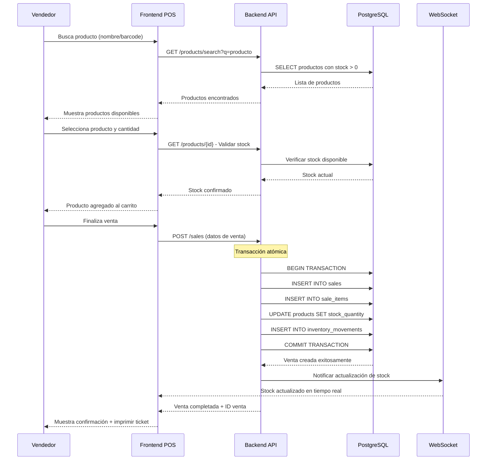
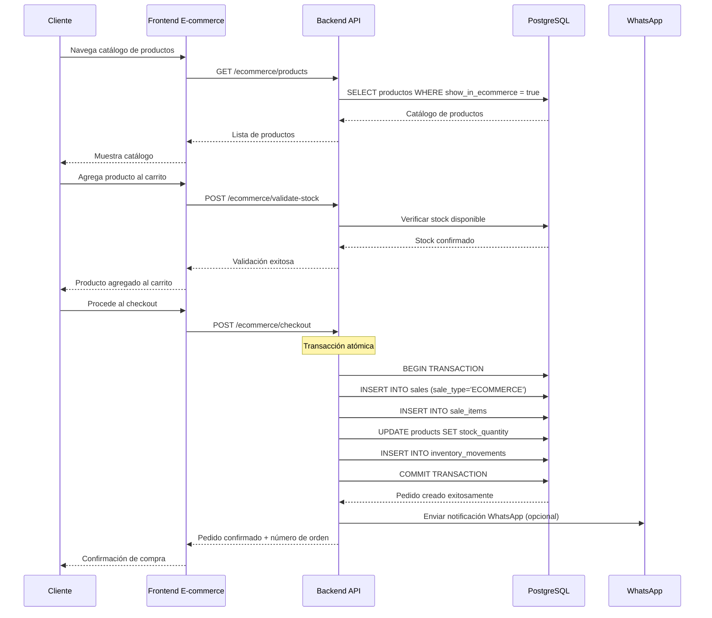
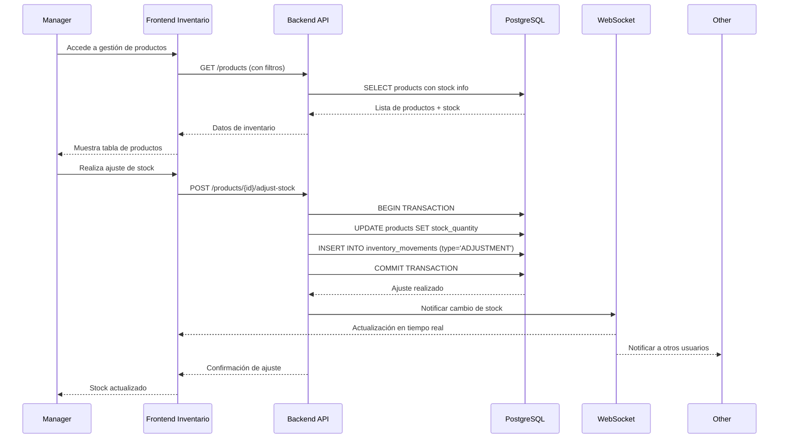
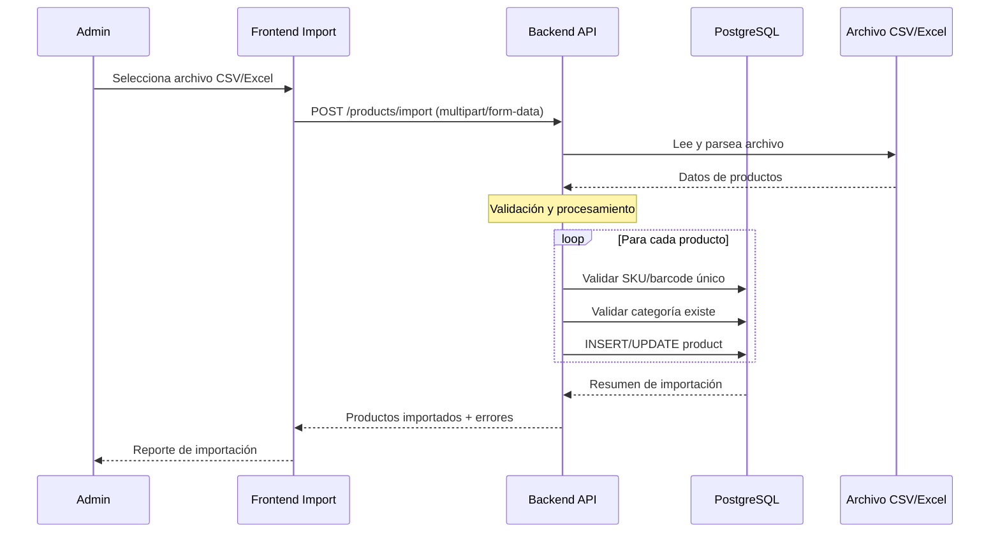

# Documentación Completa del Proyecto POS Cesariel

## Índice
1. [Resumen Ejecutivo](#resumen-ejecutivo)
2. [Arquitectura del Sistema](#arquitectura-del-sistema)
3. [Funcionalidades Principales](#funcionalidades-principales)
4. [Esquema de Base de Datos](#esquema-de-base-de-datos)
5. [API Endpoints](#api-endpoints)
6. [Flujos de Trabajo](#flujos-de-trabajo)
7. [Stack Tecnológico](#stack-tecnológico)
8. [Configuración y Despliegue](#configuración-y-despliegue)
9. [Características Técnicas](#características-técnicas)

## Resumen Ejecutivo

### ¿Qué es POS Cesariel?
POS Cesariel es un **sistema completo de punto de venta multisucursal con e-commerce integrado**, diseñado específicamente para pequeñas y medianas empresas que necesitan gestionar múltiples ubicaciones físicas junto con ventas online desde una sola plataforma unificada.

### Problemática que Resuelve
- **Gestión Fragmentada**: Muchas empresas usan sistemas separados para POS físico y e-commerce
- **Sincronización Manual**: Procesos manuales propensos a errores entre inventarios
- **Datos Desactualizados**: Falta de información en tiempo real entre sucursales
- **Experiencia Desintegrada**: Clientes y empleados enfrentan interfaces diferentes y datos inconsistentes
- **Escalabilidad Limitada**: Sistemas que no crecen con el negocio

### Valor Agregado
- **Inventario Unificado**: Un solo stock sincronizado entre POS físico y e-commerce
- **Gestión Centralizada**: Administración de múltiples sucursales desde un panel único
- **Tiempo Real**: Actualizaciones instantáneas mediante WebSockets
- **Experiencia Moderna**: Interfaces intuitivas tanto para empleados como clientes finales
- **Arquitectura Escalable**: Diseño que crece con la empresa

## Arquitectura del Sistema

### Arquitectura General
```
┌─────────────────────────────────────────────────────────────┐
│                    USUARIOS FINALES                         │
├──────────────────────┬──────────────────────────────────────┤
│    Empleados POS     │         Clientes E-commerce          │
│   (Escritorio/Web)   │          (Web/Mobile)               │
└──────────┬───────────┴──────────────────┬───────────────────┘
           │                              │
           ▼                              ▼
┌─────────────────┐              ┌─────────────────┐
│   POS Admin     │              │   E-commerce    │
│   Frontend      │              │   Frontend      │
│  (Next.js 15)   │              │  (Next.js 15)   │
│  Puerto 3000    │              │  Puerto 3001    │
└─────────┬───────┘              └─────────┬───────┘
          │                                │
          └────────────┬───────────────────┘
                       │
                       ▼
                ┌─────────────────┐
                │   Backend API   │
                │   (FastAPI)     │
                │   Puerto 8000   │
                └─────────┬───────┘
                          │
          ┌───────────────┼───────────────┐
          │               │               │
          ▼               ▼               ▼
    ┌─────────┐   ┌─────────────┐   ┌─────────────┐
    │  Cache  │   │ PostgreSQL  │   │ Cloudinary  │
    │ (Redis) │   │ Base Datos  │   │ (Imágenes)  │
    │Optional │   │Puerto 5432  │   │   CDN       │
    └─────────┘   └─────────────┘   └─────────────┘
```

### Patrón Arquitectónico
**Arquitectura de Microservicios Híbrida** con separación clara de responsabilidades:

1. **Capa de Presentación**: Dos frontends especializados (POS Admin + E-commerce)
2. **Capa de API**: Backend unificado con FastAPI
3. **Capa de Lógica de Negocio**: Servicios organizados por dominio
4. **Capa de Datos**: PostgreSQL con ORM SQLAlchemy
5. **Capa de Integración**: WebSockets para tiempo real, Cloudinary para imágenes

### Principios de Diseño
- **Single Source of Truth**: Un solo backend para ambos frontends
- **Real-time First**: Sincronización inmediata mediante WebSockets
- **API First**: Diseño API-centric que facilita futuras integraciones
- **Separation of Concerns**: Responsabilidades claramente definidas
- **Scalability**: Arquitectura preparada para crecimiento horizontal

## Funcionalidades Principales

### 1. Sistema Multisucursal 🏪
**Gestión centralizada de múltiples ubicaciones físicas**

- **Dashboard Consolidado**: Vista unificada de todas las sucursales
- **Métricas por Sucursal**: Ventas, inventario y rendimiento individual
- **Usuarios por Sucursal**: Asignación y gestión de empleados por ubicación
- **Reportes Comparativos**: Análisis entre sucursales
- **Configuración Independiente**: Impresoras, métodos de pago por sucursal

### 2. POS (Punto de Venta) 💰
**Interface optimizada para ventas rápidas en tienda física**

**Características Principales:**
- **Búsqueda Rápida**: Por nombre, SKU, código de barras
- **Escáner de Códigos**: Integración con lectores de códigos de barras
- **Carrito Interactivo**: Agregar/quitar productos con validación de stock
- **Múltiples Métodos de Pago**: Efectivo, tarjeta, transferencias
- **Información de Cliente**: Opcional para generar comprobantes
- **Descuentos y Promociones**: Aplicación manual de descuentos
- **Impresión de Tickets**: Configuración de impresoras térmicas

**Flujo de Venta POS:**
1. Empleado busca productos (texto/barcode)
2. Agrega productos al carrito (validación automática de stock)
3. Aplica descuentos si corresponde
4. Selecciona método de pago
5. Ingresa datos de cliente (opcional)
6. Procesa la venta (transacción atómica)
7. Imprime ticket automáticamente
8. Stock se actualiza en tiempo real

### 3. Inventario Centralizado 📦
**Control completo de productos y stock entre todas las sucursales**

**Gestión de Productos:**
- **CRUD Completo**: Crear, editar, eliminar productos
- **Categorización**: Organización jerárquica por categorías
- **Códigos y SKUs**: Gestión de códigos de barras y SKUs únicos
- **Precios Diferenciados**: Precio POS vs precio E-commerce
- **Imágenes Múltiples**: Subida a Cloudinary con optimización automática
- **Variantes por Talle**: Gestión de productos con múltiples talles
- **Import/Export**: Importación masiva vía CSV/Excel

**Control de Stock:**
- **Stock por Sucursal**: Distribución específica de inventario
- **Stock Mínimo**: Alertas automáticas de reposición
- **Movimientos de Inventario**: Historial completo de cambios
- **Ajustes Manuales**: Corrección de stock con motivos
- **Validación en Tiempo Real**: Verificación antes de cada venta
- **Sincronización Automática**: Entre POS y e-commerce

### 4. E-commerce Integrado 🛒
**Tienda online completa sincronizada con inventario físico**

**Frontend de Cliente:**
- **Catálogo Dinámico**: Productos sincronizados con POS
- **Filtros Avanzados**: Por categoría, precio, disponibilidad
- **Carrito Persistente**: Mantiene productos entre sesiones
- **Validación de Stock**: En tiempo real antes de compra
- **Checkout Completo**: Datos de cliente y entrega
- **Responsive Design**: Optimizado para mobile y desktop

**Panel de Administración E-commerce:**
- **Configuración de Tienda**: Logo, banner, descripción
- **Gestión de Pedidos**: Estados, seguimiento, coordinación
- **Productos Online**: Control de visibilidad por producto
- **Configuración de Envíos**: Métodos y costos
- **WhatsApp Integration**: Coordinación automática de pedidos

### 5. Sistema de Usuarios y Roles 👥
**Gestión granular de acceso y permisos**

**Roles del Sistema:**
- **ADMIN**: Acceso completo, gestión de usuarios, configuración global
- **MANAGER**: Gestión de sucursal, inventario, reportes, usuarios locales
- **SELLER**: Solo operaciones POS, sin acceso administrativo
- **ECOMMERCE**: Gestión de tienda online, pedidos e-commerce

**Características de Seguridad:**
- **Autenticación JWT**: Tokens seguros con expiración
- **Autorización por Endpoint**: Control granular de acceso
- **Sesiones Persistentes**: Login recordado con refresh tokens
- **Auditoría de Acciones**: Registro de acciones críticas
- **Encriptación de Contraseñas**: bcrypt para máxima seguridad

### 6. Reportes y Analytics 📊
**Business Intelligence completo del negocio**

**Dashboard Principal:**
- **KPIs del Día**: Ventas, productos, transacciones
- **Gráficos Interactivos**: Tendencias de ventas por período
- **Alertas de Stock**: Productos con bajo inventario
- **Performance por Sucursal**: Comparativa de rendimiento
- **Métricas de E-commerce**: Conversión, abandono de carrito

**Reportes Específicos:**
- **Ventas por Período**: Día, semana, mes, año personalizado
- **Productos Más Vendidos**: Rankings por cantidad y valor
- **Análisis de Categorías**: Performance por tipo de producto
- **Reportes de Inventario**: Movimientos, ajustes, valorización
- **Análisis de Usuarios**: Productividad por empleado

### 7. Configuración del Sistema ⚙️
**Panel de administración completo**

**Configuraciones Generales:**
- **Datos de la Empresa**: Logo, información fiscal, contacto
- **Configuración de Impresoras**: Térmicas, formatos, plantillas
- **Métodos de Pago**: Efectivo, tarjetas, transferencias, recargos
- **Impuestos y Tasas**: IVA, tasas locales, exenciones
- **Backup Automático**: Configuración de respaldos programados

**Configuraciones E-commerce:**
- **Apariencia de Tienda**: Colores, logo, banner principal
- **Métodos de Envío**: Costos, zonas, tiempos de entrega
- **Integración WhatsApp**: Coordinación automática de pedidos
- **SEO Básico**: Metadatos, descripción de tienda
- **Notificaciones**: Emails automáticos, alertas

## Esquema de Base de Datos

### Diagrama de Entidad-Relación
```
    ┌─────────────┐         ┌─────────────┐
    │   Branch    │         │    User     │
    │             │◄──────┬─┤             │
    │ id (PK)     │       │ │ id (PK)     │
    │ name        │       │ │ username    │
    │ address     │       │ │ email       │
    │ phone       │       │ │ role        │
    │ is_active   │       │ │ branch_id(FK)│
    └─────┬───────┘       │ │ is_active   │
          │               │ └─────┬───────┘
          │               │       │
          ▼               │       ▼
    ┌─────────────┐       │ ┌─────────────┐
    │    Sale     │       │ │  Category   │
    │             │◄──────┘ │             │
    │ id (PK)     │         │ id (PK)     │
    │ total       │         │ name        │
    │ sale_type   │         │ description │
    │ user_id(FK) │         │ is_active   │
    │ branch_id(FK)│        └─────┬───────┘
    │ created_at  │               │
    └─────┬───────┘               ▼
          │                 ┌─────────────┐
          ▼                 │   Product   │
    ┌─────────────┐         │             │
    │  SaleItem   │◄────────┤ id (PK)     │
    │             │         │ name        │
    │ id (PK)     │         │ sku         │
    │ sale_id(FK) │         │ barcode     │
    │ product_id(FK)│        │ price       │
    │ quantity    │         │ stock_qty   │
    │ unit_price  │         │ category_id │
    │ subtotal    │         │ image_url   │
    └─────────────┘         │ show_ecommerce│
                            │ has_sizes   │
                            └─────┬───────┘
                                  │
                            ┌─────▼───────┐
                            │ProductSize  │
                            │             │
                            │ id (PK)     │
                            │ product_id  │
                            │ size_name   │
                            │ stock_qty   │
                            │ is_active   │
                            └─────────────┘
```

### Entidades Principales

#### 1. Branch (Sucursales)
```sql
CREATE TABLE branches (
    id SERIAL PRIMARY KEY,
    name VARCHAR(100) NOT NULL,
    address VARCHAR(200),
    phone VARCHAR(20),
    email VARCHAR(100),
    is_active BOOLEAN DEFAULT TRUE,
    created_at TIMESTAMP DEFAULT NOW(),
    updated_at TIMESTAMP DEFAULT NOW()
);
```
**Propósito**: Gestión multisucursal, cada usuario y venta está asignada a una sucursal específica.

#### 2. User (Usuarios)
```sql
CREATE TABLE users (
    id SERIAL PRIMARY KEY,
    email VARCHAR(100) UNIQUE NOT NULL,
    username VARCHAR(50) UNIQUE NOT NULL,
    full_name VARCHAR(100) NOT NULL,
    hashed_password VARCHAR(255) NOT NULL,
    role user_role NOT NULL, -- ADMIN, MANAGER, SELLER, ECOMMERCE
    branch_id INTEGER REFERENCES branches(id),
    is_active BOOLEAN DEFAULT TRUE,
    created_at TIMESTAMP DEFAULT NOW(),
    updated_at TIMESTAMP DEFAULT NOW()
);
```
**Propósito**: Sistema completo de usuarios con roles y asignación por sucursal.

#### 3. Category (Categorías)
```sql
CREATE TABLE categories (
    id SERIAL PRIMARY KEY,
    name VARCHAR(100) NOT NULL,
    description TEXT,
    is_active BOOLEAN DEFAULT TRUE,
    created_at TIMESTAMP DEFAULT NOW(),
    updated_at TIMESTAMP DEFAULT NOW()
);
```
**Propósito**: Organización jerárquica de productos para POS y e-commerce.

#### 4. Product (Productos)
```sql
CREATE TABLE products (
    id SERIAL PRIMARY KEY,
    name VARCHAR(200) NOT NULL,
    description TEXT,
    sku VARCHAR(50) UNIQUE,
    barcode VARCHAR(50) UNIQUE,
    category_id INTEGER REFERENCES categories(id),
    price DECIMAL(10,2) NOT NULL,
    cost DECIMAL(10,2),
    stock_quantity INTEGER DEFAULT 0,
    min_stock INTEGER DEFAULT 0,
    is_active BOOLEAN DEFAULT TRUE,
    show_in_ecommerce BOOLEAN DEFAULT FALSE,
    ecommerce_price DECIMAL(10,2),
    image_url TEXT,
    has_sizes BOOLEAN DEFAULT FALSE,
    created_at TIMESTAMP DEFAULT NOW(),
    updated_at TIMESTAMP DEFAULT NOW()
);
```
**Propósito**: Catálogo central de productos con soporte para variantes y e-commerce.

#### 5. ProductSize (Variantes de Talle)
```sql
CREATE TABLE product_sizes (
    id SERIAL PRIMARY KEY,
    product_id INTEGER REFERENCES products(id),
    size_name VARCHAR(50) NOT NULL,
    stock_quantity INTEGER DEFAULT 0,
    is_active BOOLEAN DEFAULT TRUE,
    created_at TIMESTAMP DEFAULT NOW()
);
```
**Propósito**: Gestión de productos con múltiples talles (ropa, calzado, etc.).

#### 6. Sale (Ventas)
```sql
CREATE TABLE sales (
    id SERIAL PRIMARY KEY,
    total DECIMAL(10,2) NOT NULL,
    sale_type sale_type NOT NULL, -- POS, ECOMMERCE
    user_id INTEGER REFERENCES users(id),
    branch_id INTEGER REFERENCES branches(id),
    customer_name VARCHAR(100),
    customer_phone VARCHAR(20),
    customer_email VARCHAR(100),
    notes TEXT,
    created_at TIMESTAMP DEFAULT NOW()
);
```
**Propósito**: Registro unificado de ventas tanto POS como e-commerce.

#### 7. SaleItem (Items de Venta)
```sql
CREATE TABLE sale_items (
    id SERIAL PRIMARY KEY,
    sale_id INTEGER REFERENCES sales(id),
    product_id INTEGER REFERENCES products(id),
    product_size_id INTEGER REFERENCES product_sizes(id),
    quantity INTEGER NOT NULL,
    unit_price DECIMAL(10,2) NOT NULL,
    subtotal DECIMAL(10,2) NOT NULL
);
```
**Propósito**: Detalle línea por línea de cada venta, con soporte para variantes.

#### 8. InventoryMovement (Movimientos de Inventario)
```sql
CREATE TABLE inventory_movements (
    id SERIAL PRIMARY KEY,
    product_id INTEGER REFERENCES products(id),
    product_size_id INTEGER REFERENCES product_sizes(id),
    branch_id INTEGER REFERENCES branches(id),
    movement_type movement_type NOT NULL, -- SALE, ADJUSTMENT, TRANSFER
    quantity INTEGER NOT NULL,
    reason TEXT,
    user_id INTEGER REFERENCES users(id),
    created_at TIMESTAMP DEFAULT NOW()
);
```
**Propósito**: Auditoría completa de todos los cambios de stock.

### Entidades de Configuración

#### 9. EcommerceConfig (Configuración E-commerce)
```sql
CREATE TABLE ecommerce_config (
    id SERIAL PRIMARY KEY,
    store_name VARCHAR(200),
    store_description TEXT,
    store_logo_url TEXT,
    banner_url TEXT,
    contact_phone VARCHAR(20),
    contact_email VARCHAR(100),
    whatsapp_number VARCHAR(20),
    is_active BOOLEAN DEFAULT TRUE,
    updated_at TIMESTAMP DEFAULT NOW()
);
```

#### 10. PaymentConfig (Configuración de Pagos)
```sql
CREATE TABLE payment_config (
    id SERIAL PRIMARY KEY,
    payment_method VARCHAR(50) NOT NULL,
    is_active BOOLEAN DEFAULT TRUE,
    surcharge_percentage DECIMAL(5,2) DEFAULT 0,
    display_name VARCHAR(100),
    created_at TIMESTAMP DEFAULT NOW()
);
```

### Índices y Optimizaciones
```sql
-- Índices para búsquedas frecuentes
CREATE INDEX idx_products_sku ON products(sku);
CREATE INDEX idx_products_barcode ON products(barcode);
CREATE INDEX idx_products_category ON products(category_id);
CREATE INDEX idx_products_ecommerce ON products(show_in_ecommerce) WHERE show_in_ecommerce = TRUE;
CREATE INDEX idx_sales_branch_date ON sales(branch_id, created_at);
CREATE INDEX idx_sales_user_date ON sales(user_id, created_at);
CREATE INDEX idx_inventory_product_date ON inventory_movements(product_id, created_at);
```

## API Endpoints

### Base URL: `http://localhost:8000`

### Autenticación
```
POST   /auth/login           - Iniciar sesión (form-data)
POST   /auth/login-json      - Iniciar sesión (JSON)
GET    /auth/me              - Información usuario actual
POST   /auth/refresh         - Renovar token
```

### Gestión de Usuarios
```
GET    /users                - Listar usuarios (paginado)
POST   /users                - Crear nuevo usuario
GET    /users/{id}           - Obtener usuario específico
PUT    /users/{id}           - Actualizar usuario
DELETE /users/{id}           - Eliminar usuario (soft delete)
GET    /users/me             - Información del usuario autenticado
PUT    /users/me             - Actualizar perfil propio
```

### Sucursales
```
GET    /branches             - Listar sucursales activas
POST   /branches             - Crear nueva sucursal
GET    /branches/{id}        - Obtener sucursal específica
PUT    /branches/{id}        - Actualizar sucursal
DELETE /branches/{id}        - Eliminar sucursal
GET    /branches/{id}/users  - Usuarios de una sucursal
GET    /branches/{id}/sales  - Ventas de una sucursal
```

### Productos e Inventario
```
GET    /products                    - Listar productos (filtros múltiples)
POST   /products                    - Crear nuevo producto
GET    /products/{id}               - Obtener producto específico
PUT    /products/{id}               - Actualizar producto
DELETE /products/{id}               - Eliminar producto
GET    /products/search             - Búsqueda avanzada de productos
GET    /products/barcode/{barcode}  - Buscar por código de barras
POST   /products/import             - Importación masiva (CSV/Excel)
GET    /products/{id}/sizes         - Talles disponibles de un producto
POST   /products/{id}/sizes         - Agregar nuevo talle
PUT    /products/{id}/sizes/{size_id} - Actualizar stock de talle
GET    /products/{id}/stock-history - Historial de movimientos de stock
POST   /products/{id}/adjust-stock  - Ajuste manual de inventario
```

### Categorías
```
GET    /categories           - Listar categorías activas
POST   /categories           - Crear nueva categoría
GET    /categories/{id}      - Obtener categoría específica
PUT    /categories/{id}      - Actualizar categoría
DELETE /categories/{id}      - Eliminar categoría
GET    /categories/{id}/products - Productos de una categoría
```

### Ventas y POS
```
GET    /sales                - Listar ventas (filtros por fecha, sucursal, usuario)
POST   /sales                - Crear nueva venta (POS o E-commerce)
GET    /sales/{id}           - Obtener venta específica con items
PUT    /sales/{id}           - Actualizar venta (solo status e-commerce)
DELETE /sales/{id}           - Anular venta (solo admins)
GET    /sales/reports/dashboard     - Métricas del dashboard
GET    /sales/reports/daily        - Reporte de ventas del día
GET    /sales/reports/period       - Reporte por período personalizado
GET    /sales/reports/top-products - Productos más vendidos
GET    /sales/reports/by-branch    - Reporte por sucursal
POST   /sales/{id}/print           - Generar ticket de venta
```

### E-commerce (Público)
```
GET    /ecommerce/products          - Catálogo público de productos
GET    /ecommerce/products/{id}     - Detalle público de producto
GET    /ecommerce/categories        - Categorías públicas
GET    /ecommerce/banners          - Banners de homepage
GET    /ecommerce/config           - Configuración pública de tienda
POST   /ecommerce/checkout         - Procesar compra e-commerce
GET    /ecommerce/products/{id}/available-sizes - Talles disponibles
POST   /ecommerce/validate-stock   - Validar stock antes de compra
```

### E-commerce (Administración)
```
GET    /ecommerce-advanced/orders          - Pedidos e-commerce
PUT    /ecommerce-advanced/orders/{id}     - Actualizar estado pedido  
GET    /ecommerce-advanced/config          - Configuración administrativa
PUT    /ecommerce-advanced/config          - Actualizar configuración
POST   /ecommerce-advanced/banners         - Subir banner
DELETE /ecommerce-advanced/banners/{id}    - Eliminar banner
GET    /ecommerce-advanced/analytics       - Analytics e-commerce
```

### Configuración del Sistema
```
GET    /config/general         - Configuración general
PUT    /config/general         - Actualizar configuración general
GET    /config/payment-methods - Métodos de pago disponibles
POST   /config/payment-methods - Agregar método de pago
PUT    /config/payment-methods/{id} - Actualizar método de pago
GET    /config/tax-rates       - Tasas de impuestos
POST   /config/tax-rates       - Configurar nueva tasa
GET    /config/printers        - Configuración de impresoras
POST   /config/printers        - Configurar impresora
```

### WebSockets y Tiempo Real
```
WS     /ws                     - Conexión WebSocket principal
WS     /ws/inventory          - Notificaciones de inventario
WS     /ws/sales              - Notificaciones de ventas
WS     /ws/branch/{branch_id} - Notificaciones por sucursal
```

### Gestión de Archivos e Imágenes
```
POST   /upload/product-image   - Subir imagen de producto (Cloudinary)
POST   /upload/store-logo      - Subir logo de tienda
POST   /upload/banner          - Subir banner promocional
DELETE /upload/{image_id}      - Eliminar imagen
```

### Salud del Sistema
```
GET    /health                 - Estado general de la API
GET    /db-test                - Verificar conexión a base de datos
GET    /version                - Información de versión
GET    /metrics                - Métricas de rendimiento (opcional)
```

## Flujos de Trabajo

### 1. Flujo de Venta POS Completo


### 2. Flujo de Compra E-commerce


### 3. Flujo de Gestión de Inventario


### 4. Flujo de Importación Masiva


## Stack Tecnológico

### Backend (FastAPI + PostgreSQL)
```
📦 Backend Stack
├── 🐍 FastAPI 0.115+ - Framework web moderno y rápido
├── 🗃️ PostgreSQL 15 - Base de datos relacional robusta
├── 🔧 SQLAlchemy 2.0 - ORM con async support
├── ✅ Pydantic 2.0 - Validación de datos y serialización
├── 🔐 python-jose - JWT tokens para autenticación
├── 🔒 passlib[bcrypt] - Hash seguro de contraseñas
├── ☁️ cloudinary - CDN y gestión de imágenes
├── 📊 pandas - Procesamiento de archivos CSV/Excel
├── 🧪 pytest + pytest-asyncio - Testing framework
└── 🐳 Docker - Containerización
```

### Frontend POS Admin (Next.js + React)
```
📦 Frontend POS Stack  
├── ⚛️ Next.js 15 - Framework React con App Router
├── ⚛️ React 19 - Biblioteca de UI
├── 🎨 TailwindCSS - Framework de estilos utility-first
├── 🎭 Headless UI - Componentes accesibles
├── 🔄 Zustand - Estado global liviano
├── 📡 Axios - Cliente HTTP con interceptors
├── 📱 React Hook Form - Manejo de formularios
├── 🔥 React Hot Toast - Notificaciones
├── 📊 Recharts - Gráficos y visualizaciones
├── 🧪 Jest + RTL - Testing unitario
├── 🧪 Cypress - Testing E2E
└── 🐳 Docker - Containerización
```

### Frontend E-commerce (Next.js + Radix UI)
```
📦 Frontend E-commerce Stack
├── ⚛️ Next.js 15 - Framework React optimizado
├── ⚛️ React 19 - Biblioteca de UI
├── 🎨 TailwindCSS - Estilos responsive
├── 🎭 Radix UI - Componentes primitivos
├── 🎨 shadcn/ui - Componentes pre-construidos
├── 🔄 React Context - Estado de carrito
├── 📡 Axios - Cliente API
├── 🔥 Sonner - Toast notifications  
├── 🧪 Jest + RTL - Testing
└── 🐳 Docker - Containerización
```

### Infraestructura y DevOps
```
📦 Infrastructure Stack
├── 🐳 Docker Compose - Orquestación de contenedores
├── 🗄️ PostgreSQL 15 - Base de datos principal
├── 🌐 Adminer - Interfaz web para DB
├── 📡 WebSockets - Comunicación tiempo real
├── ☁️ Cloudinary - CDN y optimización de imágenes
├── 🔄 Hot Reload - Desarrollo con recarga automática
├── 📝 OpenAPI/Swagger - Documentación automática de API
└── 🔍 GitHub Actions - CI/CD (opcional)
```

## Configuración y Despliegue

### Desarrollo Local

#### 1. Prerequisitos
```bash
# Herramientas necesarias
- Docker Desktop
- Git
- Node.js 18+ (opcional, para desarrollo sin Docker)
- Python 3.9+ (opcional, para desarrollo sin Docker)
```

#### 2. Configuración Automática
```bash
# Clonar repositorio
git clone <repository-url>
cd pos-cesariel

# Setup automático completo
./setup.sh
```

#### 3. Configuración Manual
```bash
# Iniciar servicios
make dev

# Configurar base de datos (en otra terminal)
make shell-backend
python init_data.py          # Usuarios y datos de prueba
python init_content_data.py  # Configuración inicial
exit

# Verificar servicios
make status
make logs
```

#### 4. Variables de Entorno

**Backend (.env)**
```env
# Base de datos
DATABASE_URL=postgresql://postgres:password@db:5432/pos_cesariel
DB_HOST=db
DB_PORT=5432
DB_NAME=pos_cesariel  
DB_USER=postgres
DB_PASSWORD=password

# Seguridad
SECRET_KEY=your-super-secret-key-here
ALGORITHM=HS256
ACCESS_TOKEN_EXPIRE_MINUTES=1440

# Cloudinary (para imágenes)
CLOUDINARY_CLOUD_NAME=your-cloud-name
CLOUDINARY_API_KEY=your-api-key  
CLOUDINARY_API_SECRET=your-api-secret
```

**Frontend POS (.env.local)**
```env
NEXT_PUBLIC_API_URL=http://localhost:8000
WATCHPACK_POLLING=true
CHOKIDAR_USEPOLLING=true
```

**Frontend E-commerce (.env.local)**
```env
NEXT_PUBLIC_API_URL=http://localhost:8000
PORT=3001
```

### Despliegue Producción

#### 1. Servidor Linux (Ubuntu/CentOS)
```bash
# Instalar Docker y Docker Compose
curl -fsSL https://get.docker.com -o get-docker.sh
sh get-docker.sh
sudo pip install docker-compose

# Clonar y configurar
git clone <repository-url>
cd pos-cesariel

# Variables de producción
cp .env.example .env
# Editar .env con valores de producción

# Base de datos externa (recomendado)
# - PostgreSQL en RDS, Google Cloud SQL, etc.
# - Actualizar DATABASE_URL en .env

# SSL y dominio
# - Configurar nginx como proxy reverso
# - Certificados SSL con Let's Encrypt
# - Configurar dominios para cada frontend

# Iniciar en producción
docker-compose -f docker-compose.prod.yml up -d
```

#### 2. Servicios Cloud (AWS/GCP/Azure)
```yaml
# Ejemplo docker-compose.prod.yml
version: '3.8'
services:
  backend:
    build: ./backend
    environment:
      - DATABASE_URL=${DATABASE_URL}
      - SECRET_KEY=${SECRET_KEY}
    ports:
      - "8000:8000"
  
  frontend-pos:
    build: ./frontend/pos-cesariel
    environment:
      - NEXT_PUBLIC_API_URL=${API_URL}
    ports:
      - "3000:3000"
      
  frontend-ecommerce:
    build: ./ecommerce
    environment:
      - NEXT_PUBLIC_API_URL=${API_URL}
    ports:
      - "3001:3001"
```

## Características Técnicas

### Rendimiento y Optimización
- **Índices de Base de Datos**: Optimizados para consultas frecuentes
- **Paginación**: Todas las listas implementan paginación
- **Cache de Consultas**: SQLAlchemy lazy loading optimizado
- **Compresión de Imágenes**: Cloudinary automático
- **Minificación**: Next.js automática en producción
- **CDN**: Cloudinary para assets estáticos

### Seguridad
- **Autenticación JWT**: Tokens seguros con refresh
- **HTTPS**: Obligatorio en producción
- **CORS**: Configurado para dominios específicos
- **SQL Injection**: Protección via SQLAlchemy ORM
- **XSS**: Sanitización automática en React
- **Rate Limiting**: Implementable via middleware

### Escalabilidad
- **Arquitectura Stateless**: API sin estado para horizontal scaling
- **Base de Datos**: PostgreSQL soporta clustering
- **Cache Layer**: Redis integrable para sesiones
- **Load Balancing**: Compatible con nginx/HAProxy
- **Container Ready**: Docker para fácil escalado

### Monitoreo y Logging
- **Logs Estructurados**: JSON logging para análisis
- **Health Checks**: Endpoints de salud del sistema
- **Métricas**: Prometheus/Grafana compatible
- **Error Tracking**: Sentry integrable
- **Uptime Monitoring**: Verificación continua de servicios

### Backup y Recuperación
- **Base de Datos**: pg_dump automático
- **Imágenes**: Backup en Cloudinary
- **Configuración**: Variables en archivos versionados
- **Recovery**: Scripts de restauración automatizados

### Testing y Calidad
- **Backend**: pytest con 80% coverage mínimo
- **Frontend**: Jest + RTL para componentes
- **E2E**: Cypress para flujos completos
- **API**: Documentación automática Swagger
- **Type Safety**: TypeScript en frontend

Esta documentación proporciona una visión completa del proyecto POS Cesariel, desde su arquitectura hasta los detalles técnicos específicos necesarios para entender y replicar el sistema.