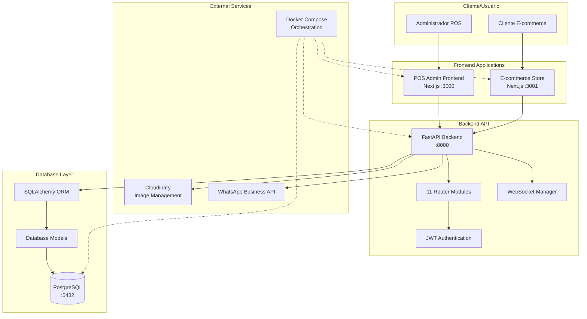
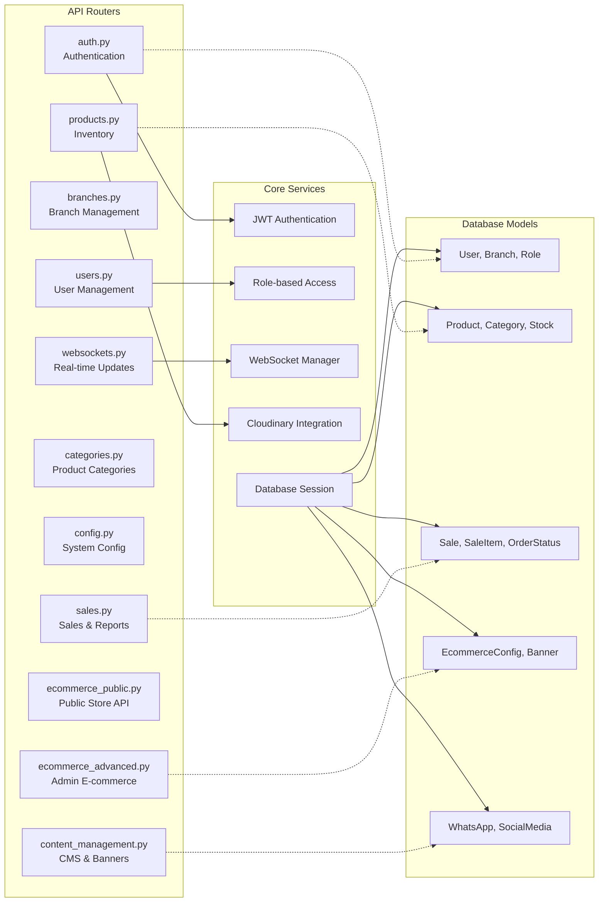
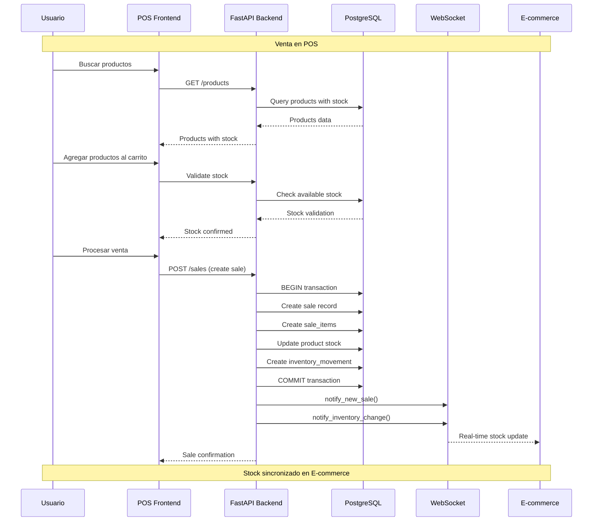
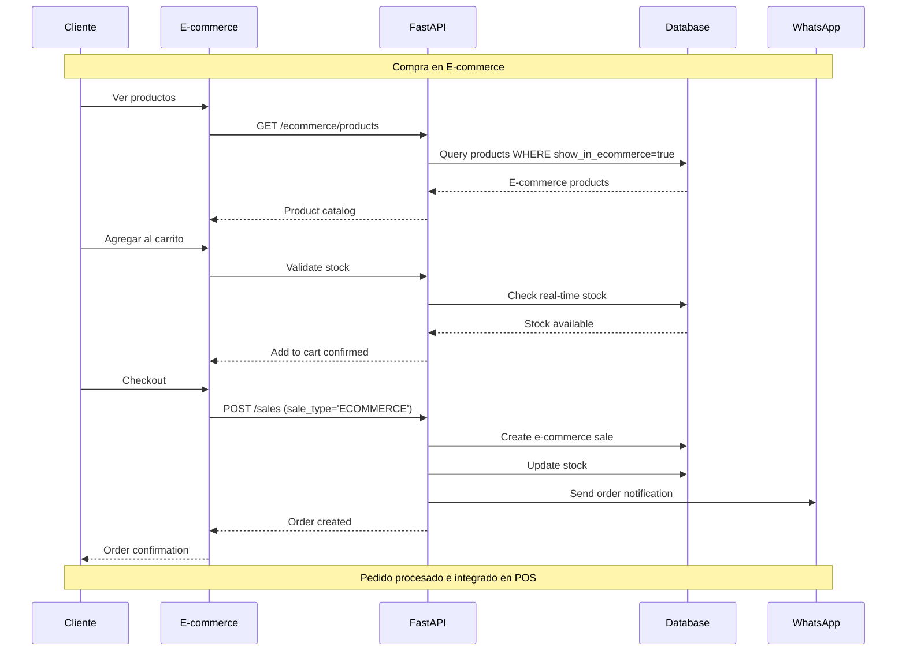
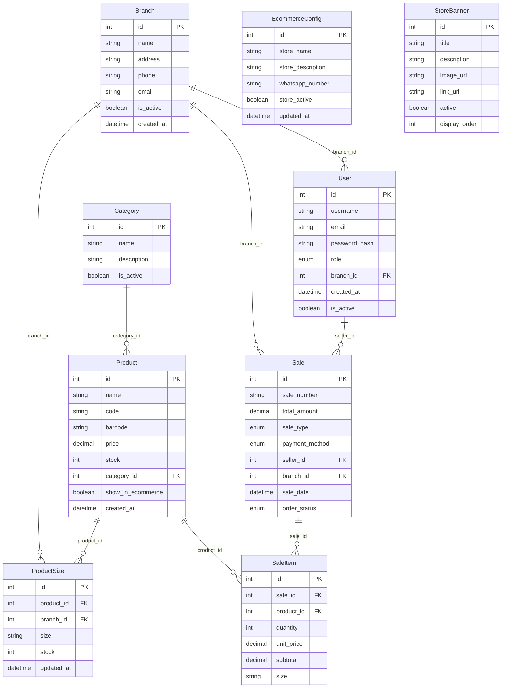
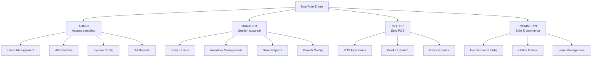
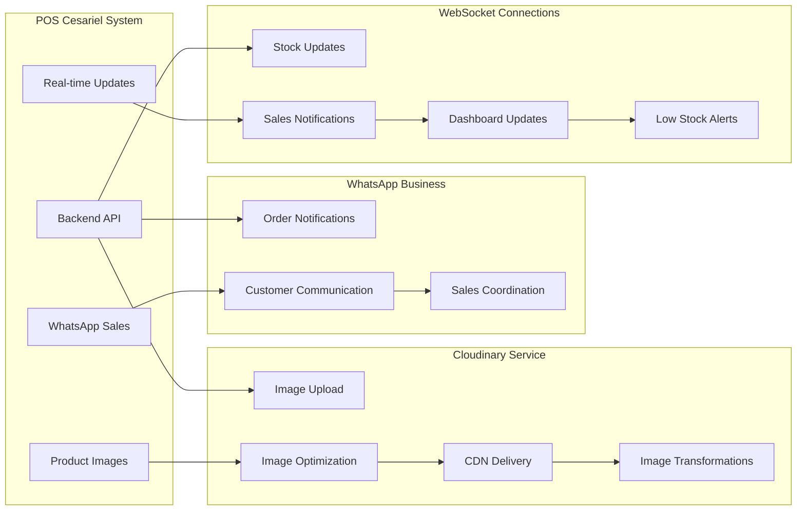
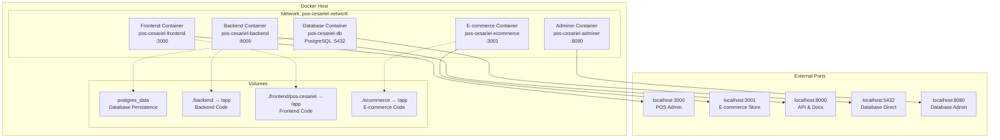
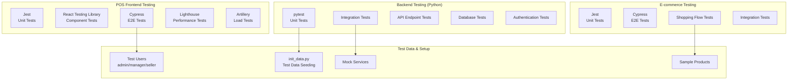

# Mapa Visual del Sistema POS Cesariel

Este documento presenta la arquitectura completa del sistema POS Cesariel mediante diagramas visuales que muestran las relaciones entre componentes, flujos de datos e integraciones.

## 1. Arquitectura General del Sistema



## 2. Arquitectura del Backend (FastAPI)



## 3. Frontend POS Admin - Estructura de Páginas

```mermaid
graph TD
    A[Root Layout<br/>Authentication]
    
    A --> B[Dashboard<br/>/:page.tsx]
    A --> C[POS System<br/>/pos/page.tsx]
    A --> D[Inventory<br/>/inventory/page.tsx]
    A --> E[Reports<br/>/reports/page.tsx]
    A --> F[Users Management<br/>/users/*]
    A --> G[Settings<br/>/settings/*]
    A --> H[E-commerce Admin<br/>/ecommerce/page.tsx]
    
    F --> F1[Users List<br/>/users/page.tsx]
    F --> F2[Create User<br/>/users/create/page.tsx]
    F --> F3[Edit User<br/>/users/edit/[id]/page.tsx]
    F --> F4[Branches<br/>/users/branches/*]
    
    G --> G1[Payment Config<br/>/settings/payment-config/]
    G --> G2[E-commerce Config<br/>/settings/ecommerce/]
    G --> G3[Store Banners<br/>/settings/store-banners/]
    G --> G4[Social Media<br/>/settings/social-media/]
    G --> G5[Currency & Tax<br/>/settings/currency/]
```

## 4. Frontend E-commerce - Estructura de Páginas

```mermaid
graph TD
    A[Root Layout<br/>E-commerce Theme]
    
    A --> B[Homepage<br/>/page.tsx<br/>Banners + Featured Products]
    A --> C[Product Catalog<br/>/productos/page.tsx]
    A --> D[Product Details<br/>/productos/[id]/page.tsx]
    A --> E[Shopping Cart<br/>/carrito/page.tsx]
    A --> F[About Us<br/>/sobre-nosotros/page.tsx]
    A --> G[Contact<br/>/contacto/page.tsx]
    
    subgraph "Components & Context"
        H[EcommerceContext<br/>Cart Management]
        I[CartContext<br/>Shopping Cart State]
        J[ProductCard<br/>Product Display]
        K[Header/Footer<br/>Navigation]
        L[Modals<br/>Size/Color/Checkout]
    end
    
    B --> H
    C --> J
    D --> L
    E --> I
    H -.-> I
```

## 5. Flujo de Datos - Sistema de Ventas



## 6. Flujo de Datos - E-commerce Integration



## 7. Modelo de Base de Datos - Relaciones Principales



## 8. Sistema de Roles y Permisos



## 9. Integraciones Externas



## 10. Deployment y Docker Compose Architecture



## 11. Testing Architecture



## Comandos de Desarrollo Principales

```bash
# Desarrollo
make dev                 # Iniciar todo el sistema
make logs-backend        # Ver logs del backend
make logs-frontend       # Ver logs POS admin
make logs-ecommerce      # Ver logs e-commerce

# Testing
pytest                   # Backend tests
npm test                 # Frontend unit tests
npm run test:e2e         # E2E tests
npm run test:lighthouse  # Performance tests

# Database
make shell-backend && python init_data.py  # Inicializar datos
make shell-db            # Acceso directo a PostgreSQL

# Acceso a servicios
http://localhost:3000    # POS Admin
http://localhost:3001    # E-commerce Store
http://localhost:8000/docs # API Documentation
http://localhost:8080    # Database Admin (Adminer)
```

---

Este mapa visual proporciona una comprensión completa del sistema POS Cesariel, desde la arquitectura de alto nivel hasta los detalles de implementación, flujos de datos, y estructura de deployment.