```mermaid
graph TD
    A[Iniciar Venta] --> B[Buscar Producto]
    B --> C{Producto Encontrado?}
    C -->|No| D[Mostrar Error]
    C -->|Sí| E[Verificar Stock]
    E --> F{Stock Disponible?}
    F -->|No| G[Alerta Sin Stock]
    F -->|Sí| H[Agregar al Carrito]
    H --> I[Actualizar Totales]
    I --> J{Más Productos?}
    J -->|Sí| B
    J -->|No| K[Ingresar Datos Cliente]
    K --> L[Seleccionar Método Pago]
    L --> M[Procesar Venta]
    M --> N[Actualizar Inventario]
    N --> O[Generar Recibo]
    O --> P[Enviar Notificaciones]
    P --> Q[Limpiar Carrito]
    Q --> R[Venta Completada]
```

```mermaid
graph TD
    A[Evento de Inventario] --> B{Tipo de Movimiento}
    B -->|Entrada| C[Recepción de Mercadería]
    B -->|Salida| D[Venta o Ajuste]
    B -->|Transferencia| E[Entre Sucursales]
    
    C --> F[Validar Datos]
    D --> F
    E --> F
    
    F --> G{Datos Válidos?}
    G -->|No| H[Mostrar Errores]
    G -->|Sí| I[Iniciar Transacción]
    
    I --> J[Crear Movimiento Inventario]
    J --> K[Actualizar Stock Producto]
    K --> L[Verificar Stock Mínimo]
    L --> M{Stock < Mínimo?}
    
    M -->|Sí| N[Generar Alerta]
    M -->|No| O[Confirmar Transacción]
    
    N --> O
    O --> P[Notificar Tiempo Real]
    P --> Q[Log de Auditoría]
    Q --> R[Proceso Completado]
```

# Flujos de Trabajo - Sistema POS Cesariel

## Índice
1. [Visión General](#visión-general)
2. [Flujo de Autenticación](#flujo-de-autenticación)
3. [Flujo de Venta POS](#flujo-de-venta-pos)
4. [Flujo de Venta E-commerce](#flujo-de-venta-e-commerce)
5. [Flujo de Gestión de Inventario](#flujo-de-gestión-de-inventario)
6. [Flujo de Notificaciones en Tiempo Real](#flujo-de-notificaciones-en-tiempo-real)
7. [Flujo de Importación de Productos](#flujo-de-importación-de-productos)
8. [Flujo de Reportes y Analytics](#flujo-de-reportes-y-analytics)
9. [Flujo de Configuración del Sistema](#flujo-de-configuración-del-sistema)
10. [Flujos de Error y Recuperación](#flujos-de-error-y-recuperación)

## Visión General

El sistema POS Cesariel implementa múltiples flujos de trabajo interconectados que permiten la operación eficiente de un negocio multisucursal con e-commerce integrado. Cada flujo está diseñado para ser robusto, escalable y proporcionar una experiencia fluida tanto para usuarios internos como clientes.

### Características de los Flujos

- **🔄 Tiempo Real**: Sincronización instantánea entre componentes
- **🛡️ Transaccionales**: Operaciones atómicas para integridad de datos
- **📱 Multi-plataforma**: Funcionan en POS, e-commerce y móvil
- **🔒 Seguros**: Validación y autorización en cada paso
- **📊 Auditables**: Registro completo de actividades

## Flujo de Autenticación

### Diagrama de Flujo


### Proceso Detallado

#### 1. **Inicio de Sesión**
```typescript
async function loginFlow(credentials: LoginCredentials) {
  // 1. Validación frontend
  const validationErrors = validateCredentials(credentials);
  if (validationErrors.length > 0) {
    throw new ValidationError(validationErrors);
  }
  
  // 2. Llamada al backend
  const response = await authApi.login(credentials);
  
  // 3. Procesamiento de respuesta
  const { user, access_token, permissions } = response;
  
  // 4. Configuración del cliente HTTP
  apiClient.defaults.headers.common['Authorization'] = `Bearer ${access_token}`;
  
  // 5. Actualización del estado global
  useAuthStore.getState().setUser(user);
  useAuthStore.getState().setToken(access_token);
  
  // 6. Conexión WebSocket
  connectWebSocket(user.branch_id, access_token);
  
  // 7. Redirección según rol
  const redirectPath = getRedirectPathByRole(user.role);
  router.push(redirectPath);
}
```

#### 2. **Validación de Token**
```typescript
async function tokenValidationFlow() {
  // 1. Interceptor de requests
  apiClient.interceptors.request.use(async (config) => {
    const token = getStoredToken();
    
    // 2. Verificar expiración
    if (isTokenExpired(token)) {
      try {
        // 3. Renovar token
        const newToken = await refreshToken(token);
        config.headers.Authorization = `Bearer ${newToken}`;
      } catch (error) {
        // 4. Token inválido, cerrar sesión
        logout();
        throw new AuthenticationError('Sesión expirada');
      }
    }
    
    return config;
  });
}
```

#### 3. **Cierre de Sesión**
```typescript
async function logoutFlow() {
  // 1. Desconectar WebSocket
  disconnectWebSocket();
  
  // 2. Limpiar almacenamiento local
  localStorage.removeItem('auth-token');
  localStorage.removeItem('user-data');
  
  // 3. Limpiar headers HTTP
  delete apiClient.defaults.headers.common['Authorization'];
  
  // 4. Limpiar estado global
  useAuthStore.getState().reset();
  
  // 5. Redirigir al login
  router.push('/login');
}
```

## Flujo de Venta POS

### Diagrama de Flujo



### Proceso Detallado

#### 1. **Búsqueda y Selección de Productos**
```typescript
async function productSearchFlow(barcode: string) {
  try {
    // 1. Búsqueda por código de barras
    const product = await productsApi.searchByBarcode(barcode);
    
    // 2. Verificación de stock
    if (product.stock <= 0) {
      throw new InsufficientStockError(product.name, 1, product.stock);
    }
    
    // 3. Verificación de producto activo
    if (!product.is_active) {
      throw new BusinessLogicError('Producto no disponible para venta');
    }
    
    // 4. Agregar al carrito
    cartStore.addItem(product, 1);
    
    // 5. Feedback visual
    toast.success(`${product.name} agregado al carrito`);
    
    // 6. Log de auditoría
    auditLog.record('PRODUCT_ADDED_TO_CART', {
      product_id: product.id,
      user_id: currentUser.id,
      branch_id: currentUser.branch_id
    });
    
  } catch (error) {
    handleSearchError(error);
  }
}
```

#### 2. **Procesamiento de Venta**
```typescript
async function processSaleFlow(saleData: SaleData) {
  // 1. Validación pre-venta
  const validation = await validateSale(saleData);
  if (!validation.isValid) {
    throw new ValidationError(validation.errors);
  }
  
  // 2. Inicio de transacción
  const transaction = await db.beginTransaction();
  
  try {
    // 3. Crear registro de venta
    const sale = await salesApi.create({
      ...saleData,
      sale_number: generateSaleNumber(),
      branch_id: currentUser.branch_id,
      user_id: currentUser.id,
      status: 'PROCESSING'
    });
    
    // 4. Procesar items de venta
    for (const item of saleData.items) {
      // 4.1 Verificar stock nuevamente
      const currentStock = await getProductStock(item.product_id);
      if (currentStock < item.quantity) {
        throw new InsufficientStockError(
          item.product.name, 
          item.quantity, 
          currentStock
        );
      }
      
      // 4.2 Crear item de venta
      await saleItemsApi.create({
        sale_id: sale.id,
        product_id: item.product_id,
        quantity: item.quantity,
        unit_price: item.unit_price,
        total_price: item.quantity * item.unit_price
      });
      
      // 4.3 Actualizar stock
      await inventoryApi.updateStock(item.product_id, -item.quantity, {
        reason: 'SALE',
        reference_id: sale.id,
        branch_id: currentUser.branch_id,
        user_id: currentUser.id
      });
    }
    
    // 5. Finalizar venta
    await salesApi.update(sale.id, {
      status: 'COMPLETED',
      completed_at: new Date()
    });
    
    // 6. Confirmar transacción
    await transaction.commit();
    
    // 7. Notificaciones tiempo real
    await notifyRealTime('NEW_SALE', {
      sale_number: sale.sale_number,
      total: sale.total,
      branch_id: sale.branch_id
    });
    
    // 8. Generar recibo
    const receipt = await generateReceipt(sale);
    
    // 9. Limpiar carrito
    cartStore.clear();
    
    return { sale, receipt };
    
  } catch (error) {
    // Rollback en caso de error
    await transaction.rollback();
    throw error;
  }
}
```

## Flujo de Venta E-commerce

### Diagrama de Flujo


### Proceso Detallado

#### 1. **Carga de Datos con Fallback**
```typescript
async function loadEcommerceDataFlow() {
  try {
    // 1. Verificar conectividad
    const isBackendOnline = await checkBackendHealth();
    
    if (isBackendOnline) {
      // 2. Cargar datos en paralelo del backend POS
      const [products, categories, banners, config] = await Promise.allSettled([
        ecommerceApi.getProducts(),
        ecommerceApi.getCategories(), 
        ecommerceApi.getBanners(),
        ecommerceApi.getEcommerceConfig()
      ]);
      
      // 3. Procesar resultados exitosos
      const processedData = processApiResults([products, categories, banners, config]);
      
      // 4. Cache local para uso offline
      cacheManager.store('ecommerce_data', processedData, 5 * 60 * 1000); // 5 min
      
      return processedData;
      
    } else {
      // 5. Usar datos estáticos como fallback
      console.warn('Backend offline, using static data');
      return getFallbackData();
    }
    
  } catch (error) {
    console.error('Error loading ecommerce data:', error);
    
    // 6. Intentar usar cache local
    const cachedData = cacheManager.get('ecommerce_data');
    if (cachedData) {
      return cachedData;
    }
    
    // 7. Última opción: datos estáticos
    return getFallbackData();
  }
}
```

#### 2. **Proceso de Checkout E-commerce**
```typescript
async function ecommerceCheckoutFlow(cartData: CartData, customerData: CustomerData) {
  try {
    // 1. Validación final de stock
    for (const item of cartData.items) {
      const isAvailable = await validateProductStock(item.product_id, item.quantity);
      if (!isAvailable) {
        throw new InsufficientStockError(
          item.product.name,
          item.quantity,
          await getAvailableStock(item.product_id)
        );
      }
    }
    
    // 2. Preparar datos de venta para POS
    const posaleData = {
      sale_type: 'ECOMMERCE',
      customer_name: customerData.name,
      customer_email: customerData.email,
      customer_phone: customerData.phone,
      items: cartData.items.map(item => ({
        product_id: item.product_id,
        quantity: item.quantity,
        unit_price: item.unit_price,
        size: item.selectedSize,
        color: item.selectedColor
      })),
      subtotal: cartData.subtotal,
      tax_amount: cartData.subtotal * 0.21,
      total: cartData.subtotal * 1.21,
      payment_method: 'PENDING_CONFIRMATION',
      notes: `Pedido e-commerce ${new Date().toISOString()}`,
      branch_id: 1, // Sucursal principal para e-commerce
      user_id: null // Venta sin usuario específico
    };
    
    // 3. Crear venta en sistema POS
    const sale = await ecommerceApi.createSale(posaleData);
    
    // 4. Limpiar carrito
    clearCart();
    
    // 5. Generar mensaje para WhatsApp
    const whatsappMessage = generateOrderMessage(sale, customerData);
    
    // 6. Redirigir a WhatsApp
    const whatsappUrl = `https://wa.me/${WHATSAPP_NUMBER}?text=${encodeURIComponent(whatsappMessage)}`;
    window.open(whatsappUrl, '_blank');
    
    // 7. Mostrar confirmación
    showOrderConfirmation(sale.sale_number);
    
    // 8. Analytics
    trackEcommerceConversion(sale);
    
    return sale;
    
  } catch (error) {
    handleCheckoutError(error);
    throw error;
  }
}
```

## Flujo de Gestión de Inventario

### Diagrama de Flujo



### Proceso Detallado

#### 1. **Movimiento de Inventario**
```typescript
async function inventoryMovementFlow(movementData: InventoryMovementData) {
  const transaction = await db.beginTransaction();
  
  try {
    // 1. Validaciones iniciales
    const validation = validateMovementData(movementData);
    if (!validation.isValid) {
      throw new ValidationError(validation.errors);
    }
    
    // 2. Verificar permisos
    if (!canUserManageInventory(currentUser)) {
      throw new AuthorizationError('No tienes permisos para gestionar inventario');
    }
    
    // 3. Obtener stock actual
    const currentProduct = await productsApi.getById(movementData.product_id);
    const currentStock = currentProduct.stock;
    
    // 4. Calcular nuevo stock
    let newStock: number;
    switch (movementData.movement_type) {
      case 'IN':
        newStock = currentStock + movementData.quantity;
        break;
      case 'OUT':
        newStock = currentStock - movementData.quantity;
        if (newStock < 0) {
          throw new InsufficientStockError(
            currentProduct.name,
            movementData.quantity,
            currentStock
          );
        }
        break;
      case 'ADJUSTMENT':
        newStock = movementData.quantity;
        break;
    }
    
    // 5. Crear registro de movimiento
    const movement = await inventoryMovementsApi.create({
      product_id: movementData.product_id,
      movement_type: movementData.movement_type,
      quantity: movementData.quantity,
      previous_stock: currentStock,
      new_stock: newStock,
      reason: movementData.reason,
      reference_id: movementData.reference_id,
      branch_id: currentUser.branch_id,
      user_id: currentUser.id,
      notes: movementData.notes
    });
    
    // 6. Actualizar stock del producto
    await productsApi.update(movementData.product_id, {
      stock: newStock,
      updated_at: new Date()
    });
    
    // 7. Verificar stock mínimo
    if (newStock <= currentProduct.min_stock && newStock > 0) {
      await generateLowStockAlert(currentProduct, newStock);
    }
    
    // 8. Stock agotado
    if (newStock === 0) {
      await generateOutOfStockAlert(currentProduct);
    }
    
    // 9. Confirmar transacción
    await transaction.commit();
    
    // 10. Notificaciones tiempo real
    await notifyInventoryUpdate(movement);
    
    // 11. Auditoría
    auditLog.record('INVENTORY_MOVEMENT', {
      movement_id: movement.id,
      product_id: movementData.product_id,
      old_stock: currentStock,
      new_stock: newStock,
      user_id: currentUser.id,
      branch_id: currentUser.branch_id
    });
    
    return movement;
    
  } catch (error) {
    await transaction.rollback();
    throw error;
  }
}
```

#### 2. **Sistema de Alertas de Stock**
```typescript
async function stockAlertFlow(product: Product, currentStock: number) {
  // 1. Determinar tipo de alerta
  const alertType = currentStock <= 0 ? 'OUT_OF_STOCK' : 'LOW_STOCK';
  
  // 2. Crear notificación
  const notification = {
    type: alertType,
    title: alertType === 'OUT_OF_STOCK' ? '⚠️ Producto Agotado' : '🔄 Stock Bajo',
    message: alertType === 'OUT_OF_STOCK' 
      ? `${product.name} se ha agotado`
      : `${product.name} tiene stock bajo (${currentStock} unidades)`,
    product_id: product.id,
    current_stock: currentStock,
    min_stock: product.min_stock,
    priority: alertType === 'OUT_OF_STOCK' ? 'HIGH' : 'MEDIUM',
    created_at: new Date()
  };
  
  // 3. Enviar a usuarios con permisos
  const managersAndAdmins = await getUsersByRoles(['ADMIN', 'MANAGER']);
  
  for (const user of managersAndAdmins) {
    // 3.1 Notificación en tiempo real
    await webSocketManager.sendToUser(user.id, {
      type: 'STOCK_ALERT',
      data: notification
    });
    
    // 3.2 Email si configurado
    if (user.email_notifications) {
      await emailService.sendStockAlert(user.email, notification);
    }
  }
  
  // 4. Registrar en base de datos
  await notificationsApi.create(notification);
}
```

## Flujo de Notificaciones en Tiempo Real

### Diagrama de Flujo WebSocket

```mermaid
sequenceDiagram
    participant C as Cliente
    participant WS as WebSocket Server
    participant B as Backend
    participant DB as Base de Datos
    participant O as Otros Clientes

    C->>WS: Conectar WebSocket
    WS->>B: Validar token JWT
    B-->>WS: Token válido
    WS->>WS: Agregar cliente a branch
    
    Note over B: Evento ocurre (venta, stock, etc.)
    B->>WS: Enviar notificación
    WS->>WS: Filtrar por branch/permisos
    WS->>C: Enviar a cliente específico
    WS->>O: Broadcast a otros clientes
    
    C->>WS: Marcar como leída
    WS->>DB: Actualizar estado
```



### Proceso Detallado

#### 1. **Gestor de WebSockets**
```typescript
class WebSocketManager {
  private clients = new Map<string, WebSocket>();
  private branchClients = new Map<number, Set<string>>();
  
  async connect(websocket: WebSocket, clientId: string, branchId: number, token: string) {
    try {
      // 1. Validar token JWT
      const user = await this.validateToken(token);
      if (!user) {
        websocket.close(1008, 'Token inválido');
        return;
      }
      
      // 2. Registrar cliente
      this.clients.set(clientId, websocket);
      
      // 3. Agregar a grupo de sucursal
      if (!this.branchClients.has(branchId)) {
        this.branchClients.set(branchId, new Set());
      }
      this.branchClients.get(branchId)!.add(clientId);
      
      // 4. Configurar handlers
      websocket.on('message', (message) => this.handleMessage(clientId, message));
      websocket.on('close', () => this.disconnect(clientId, branchId));
      
      // 5. Enviar confirmación
      this.sendToClient(clientId, {
        type: 'CONNECTION_CONFIRMED',
        data: { clientId, branchId, user: user.username }
      });
      
      // 6. Enviar notificaciones pendientes
      const pendingNotifications = await this.getPendingNotifications(user.id);
      for (const notification of pendingNotifications) {
        this.sendToClient(clientId, {
          type: 'NOTIFICATION',
          data: notification
        });
      }
      
    } catch (error) {
      console.error('WebSocket connection error:', error);
      websocket.close(1011, 'Error interno');
    }
  }
  
  async broadcastToBranch(branchId: number, message: any) {
    const branchClients = this.branchClients.get(branchId);
    if (!branchClients) return;
    
    for (const clientId of branchClients) {
      this.sendToClient(clientId, message);
    }
  }
  
  async sendToClient(clientId: string, message: any) {
    const client = this.clients.get(clientId);
    if (client && client.readyState === WebSocket.OPEN) {
      try {
        client.send(JSON.stringify(message));
      } catch (error) {
        console.error(`Error sending to client ${clientId}:`, error);
        this.clients.delete(clientId);
      }
    }
  }
  
  private handleMessage(clientId: string, message: Buffer) {
    try {
      const data = JSON.parse(message.toString());
      
      switch (data.type) {
        case 'PING':
          this.sendToClient(clientId, { type: 'PONG' });
          break;
          
        case 'MARK_NOTIFICATIONS_READ':
          this.markNotificationsAsRead(clientId, data.notificationIds);
          break;
          
        case 'REQUEST_SYNC':
          this.sendSyncData(clientId);
          break;
      }
      
    } catch (error) {
      console.error('Error handling message:', error);
    }
  }
}
```

#### 2. **Tipos de Notificaciones**
```typescript
enum NotificationType {
  NEW_SALE = 'NEW_SALE',
  LOW_STOCK = 'LOW_STOCK',
  OUT_OF_STOCK = 'OUT_OF_STOCK',
  USER_ACTION = 'USER_ACTION',
  SYSTEM_ALERT = 'SYSTEM_ALERT',
  INVENTORY_UPDATE = 'INVENTORY_UPDATE'
}

async function sendNotification(type: NotificationType, data: any, targetBranch?: number) {
  const notification = {
    id: generateUUID(),
    type,
    timestamp: new Date(),
    data,
    read: false
  };
  
  // 1. Guardar en base de datos
  await notificationsApi.create(notification);
  
  // 2. Enviar en tiempo real
  if (targetBranch) {
    await webSocketManager.broadcastToBranch(targetBranch, {
      type: 'NOTIFICATION',
      data: notification
    });
  } else {
    await webSocketManager.broadcastSystem({
      type: 'NOTIFICATION',
      data: notification
    });
  }
  
  // 3. Analytics
  analyticsTracker.track('notification_sent', {
    type,
    branch: targetBranch,
    timestamp: notification.timestamp
  });
}
```

## Flujo de Importación de Productos

### Diagrama de Flujo


### Proceso Detallado

#### 1. **Procesamiento de Archivo**
```typescript
async function productImportFlow(file: File, options: ImportOptions) {
  const importSession = {
    id: generateUUID(),
    filename: file.name,
    startTime: new Date(),
    status: 'PROCESSING',
    totalRows: 0,
    processedRows: 0,
    successRows: 0,
    errorRows: 0,
    errors: [] as ImportError[]
  };
  
  try {
    // 1. Validar archivo
    const fileValidation = validateImportFile(file);
    if (!fileValidation.isValid) {
      throw new ValidationError(fileValidation.errors);
    }
    
    // 2. Parsear contenido
    const rows = await parseImportFile(file);
    importSession.totalRows = rows.length;
    
    // 3. Validar estructura
    const structureValidation = validateImportStructure(rows);
    if (!structureValidation.isValid) {
      importSession.errors.push(...structureValidation.errors);
      throw new ValidationError('Estructura de archivo inválida');
    }
    
    // 4. Procesar productos en lotes
    const BATCH_SIZE = 50;
    const batches = chunk(rows, BATCH_SIZE);
    
    for (const batch of batches) {
      await processBatch(batch, importSession);
    }
    
    // 5. Finalizar importación
    importSession.status = importSession.errorRows > 0 ? 'COMPLETED_WITH_ERRORS' : 'COMPLETED';
    importSession.endTime = new Date();
    
    // 6. Generar reporte
    const report = generateImportReport(importSession);
    
    // 7. Notificar resultado
    await notifyImportComplete(importSession);
    
    return report;
    
  } catch (error) {
    importSession.status = 'FAILED';
    importSession.endTime = new Date();
    throw error;
  }
}

async function processBatch(batch: any[], session: ImportSession) {
  const transaction = await db.beginTransaction();
  
  try {
    for (const row of batch) {
      try {
        // 1. Validar datos del producto
        const validation = validateProductData(row);
        if (!validation.isValid) {
          session.errors.push({
            row: session.processedRows + 1,
            errors: validation.errors
          });
          session.errorRows++;
          continue;
        }
        
        // 2. Transformar datos
        const productData = transformRowToProduct(row);
        
        // 3. Verificar si existe (por SKU)
        const existingProduct = await productsApi.getBySku(productData.sku);
        
        if (existingProduct) {
          // 4. Actualizar producto existente
          await productsApi.update(existingProduct.id, productData);
          
          // 5. Crear movimiento de inventario si cambió el stock
          if (productData.stock !== existingProduct.stock) {
            await inventoryMovementsApi.create({
              product_id: existingProduct.id,
              movement_type: 'ADJUSTMENT',
              quantity: productData.stock,
              reason: 'IMPORT_UPDATE',
              reference_id: session.id,
              branch_id: currentUser.branch_id,
              user_id: currentUser.id
            });
          }
        } else {
          // 6. Crear nuevo producto
          const newProduct = await productsApi.create(productData);
          
          // 7. Crear movimiento inicial de inventario
          if (productData.stock > 0) {
            await inventoryMovementsApi.create({
              product_id: newProduct.id,
              movement_type: 'IN',
              quantity: productData.stock,
              reason: 'IMPORT_INITIAL',
              reference_id: session.id,
              branch_id: currentUser.branch_id,
              user_id: currentUser.id
            });
          }
        }
        
        session.successRows++;
        
      } catch (error) {
        session.errors.push({
          row: session.processedRows + 1,
          errors: [error.message]
        });
        session.errorRows++;
      }
      
      session.processedRows++;
    }
    
    await transaction.commit();
    
  } catch (error) {
    await transaction.rollback();
    throw error;
  }
}
```

## Flujo de Reportes y Analytics

### Proceso de Generación de Reportes

```typescript
async function generateDashboardStats(branchId?: number, dateRange?: DateRange) {
  try {
    // 1. Definir período de análisis
    const { startDate, endDate } = dateRange || getDefaultDateRange();
    
    // 2. Ejecutar consultas en paralelo
    const [
      salesStats,
      productStats,
      inventoryStats,
      customerStats
    ] = await Promise.all([
      getSalesStatistics(branchId, startDate, endDate),
      getProductStatistics(branchId, startDate, endDate),
      getInventoryStatistics(branchId),
      getCustomerStatistics(branchId, startDate, endDate)
    ]);
    
    // 3. Compilar dashboard data
    const dashboardData = {
      // Métricas principales
      totalSales: salesStats.totalSales,
      totalRevenue: salesStats.totalRevenue,
      averageTicket: salesStats.averageTicket,
      
      // Comparación período anterior
      salesGrowth: calculateGrowth(salesStats.currentPeriod, salesStats.previousPeriod),
      revenueGrowth: calculateGrowth(salesStats.currentRevenue, salesStats.previousRevenue),
      
      // Productos más vendidos
      topProducts: productStats.topProducts,
      lowStockProducts: inventoryStats.lowStockProducts,
      
      // Análisis temporal
      salesByHour: salesStats.hourlyDistribution,
      salesByDay: salesStats.dailyDistribution,
      
      // Métodos de pago
      paymentMethodsDistribution: salesStats.paymentMethods,
      
      // Inventario
      totalProducts: inventoryStats.totalProducts,
      outOfStockProducts: inventoryStats.outOfStockProducts,
      inventoryValue: inventoryStats.totalValue,
      
      // Clientes
      newCustomers: customerStats.newCustomers,
      returningCustomers: customerStats.returningCustomers,
      
      // Metadata
      generatedAt: new Date(),
      dateRange: { startDate, endDate },
      branchId
    };
    
    // 4. Cache temporal
    await cacheManager.set(`dashboard_${branchId || 'all'}`, dashboardData, 300); // 5 min
    
    return dashboardData;
    
  } catch (error) {
    console.error('Error generating dashboard stats:', error);
    throw new BusinessLogicError('Error generando estadísticas del dashboard');
  }
}
```

## Conclusiones

Los flujos de trabajo del sistema POS Cesariel están diseñados para:

- ✅ **Integridad**: Operaciones transaccionales que mantienen consistencia
- ✅ **Performance**: Procesamiento eficiente con operaciones paralelas
- ✅ **Escalabilidad**: Arquitectura preparada para crecimiento
- ✅ **Confiabilidad**: Manejo robusto de errores y recuperación
- ✅ **Auditabilidad**: Registro completo de todas las operaciones
- ✅ **Tiempo Real**: Sincronización instantánea entre componentes

Estos flujos proporcionan la base sólida para un sistema empresarial que puede manejar operaciones complejas de manera eficiente y confiable.