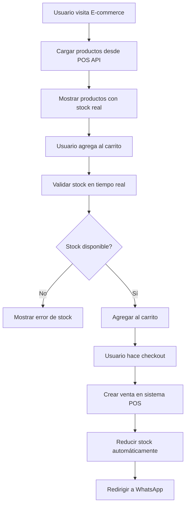

# 🚀 E-commerce POS Integration - Guía Completa

## 📋 Resumen de la Integración

He configurado completamente la integración entre tu página e-commerce existente y el backend del sistema POS Cesariel. El e-commerce ahora puede:

- ✅ **Conectarse al backend POS** en tiempo real
- ✅ **Obtener productos reales** desde la base de datos
- ✅ **Validar stock** antes de agregar al carrito
- ✅ **Crear ventas e-commerce** en el sistema POS
- ✅ **Gestionar talles** por sucursal
- ✅ **Sincronizar inventario** automáticamente

## 🗂️ Archivos Creados/Configurados

### 📁 Configuración Base
- `.env.local` - Variables de entorno (puerto 3001, API URL)
- `package.json` - Dependencia axios agregada

### 📁 API y Servicios (`app/lib/`)
- `api.ts` - Cliente API completo con endpoints del POS
- `api-types.ts` - Tipos TypeScript compatibles con el backend
- `data-service.ts` - Servicio principal con cache y fallback

### 📁 Hooks Personalizados (`app/hooks/`)
- `useProducts.ts` - Hooks para productos, búsqueda y categorías

### 📁 Contextos (`app/context/`)
- `EcommerceContext.tsx` - Contexto extendido con integración de ventas

### 📁 Componentes (`app/components/`)
- `ConnectionStatus.tsx` - Indicador de estado de conexión

### 📁 Scripts (`scripts/`)
- `migrate-to-api.js` - Script automático de migración

### 📁 Documentación
- `INTEGRATION.md` - Guía técnica de integración
- `README-INTEGRATION.md` - Esta guía completa

## 🛠️ Pasos para Activar la Integración

### 1. Instalar Dependencias
```bash
cd /Users/ignacioweigandt/Documentos/Tesis/ecommerce-pos
npm install axios
```

### 2. Verificar Backend POS
```bash
# Terminal 1: Iniciar backend POS
cd /Users/ignacioweigandt/Documentos/Tesis/pos-cesariel
make dev

# Verificar que funcione
curl http://localhost:8000/health
```

### 3. Configurar Productos para E-commerce
```bash
# Conectarse al backend POS
make shell-backend

# Dentro del contenedor backend, ejecutar:
python -c "
from database import get_db
from models import Product
db = next(get_db())

# Habilitar productos para e-commerce
products = db.query(Product).filter(Product.is_active == True).all()
for product in products:
    product.show_in_ecommerce = True
    if not product.ecommerce_price:
        product.ecommerce_price = product.price
db.commit()
print(f'Habilitados {len(products)} productos para e-commerce')
"
```

### 4. Iniciar E-commerce
```bash
# Terminal 2: Iniciar e-commerce
cd /Users/ignacioweigandt/Documentos/Tesis/ecommerce-pos
npm run dev
# Ahora corriendo en http://localhost:3001
```

## 🔧 Migración Automática (Opcional)

Si prefieres aplicar automáticamente todas las actualizaciones:

```bash
cd /Users/ignacioweigandt/Documentos/Tesis/ecommerce-pos
node scripts/migrate-to-api.js
```

## 🔄 Flujo de Integración Completo



## 📊 Características Implementadas

### 🏪 **Página Principal Integrada**
- Banners dinámicos desde admin POS
- Productos destacados con stock real
- Indicador de conexión en tiempo real
- Fallback automático si no hay conexión

### 🛍️ **Catálogo de Productos**
- Productos reales desde base de datos POS
- Filtros por categoría, marca, precio
- Stock actualizado en tiempo real
- Búsqueda integrada con backend

### 🔍 **Detalles de Producto**
- Información real del producto
- Stock específico por talle
- Validación antes de agregar al carrito
- Múltiples imágenes (si están configuradas)

### 🛒 **Carrito Inteligente**
- Validación de stock en tiempo real
- Gestión de talles por sucursal
- Creación automática de ventas e-commerce
- Integración con WhatsApp

### 📱 **Estado de Conexión**
- Monitoreo automático del backend
- Feedback visual al usuario
- Modo offline con datos de respaldo
- Reconnect automático

## 🎯 **URLs del Sistema**

| Servicio | URL | Descripción |
|----------|-----|-------------|
| **POS Admin** | http://localhost:3000 | Panel administrativo POS |
| **POS API** | http://localhost:8000 | Backend API |
| **E-commerce** | http://localhost:3001 | Tienda online |
| **API Docs** | http://localhost:8000/docs | Documentación Swagger |
| **Database** | http://localhost:8080 | Adminer (admin BD) |

## 🔍 **Testing de la Integración**

### 1. **Test de Conexión**
```bash
# Verificar health del API
curl http://localhost:8000/health

# Verificar productos para e-commerce
curl "http://localhost:8000/products?show_in_ecommerce=true"
```

### 2. **Test del E-commerce**
1. Abrir http://localhost:3001
2. Verificar que aparece "✅ Conectado al sistema POS"
3. Ver productos reales en la página principal
4. Navegar a catálogo y verificar filtros
5. Agregar producto al carrito
6. Procesar checkout (debe crear venta en POS)

### 3. **Test de Sincronización**
1. Abrir POS admin (localhost:3000)
2. Cambiar stock de un producto
3. Verificar que se actualiza en e-commerce
4. Crear venta desde e-commerce
5. Verificar que aparece en POS admin

## ⚠️ **Troubleshooting**

### **Error: "Cannot resolve module 'axios'"**
```bash
cd /Users/ignacioweigandt/Documentos/Tesis/ecommerce-pos
npm install axios
```

### **Error: "CORS policy"**
Verificar que el backend POS tenga configurado:
```python
allow_origins=["http://localhost:3001"]
```

### **Error: "Connection refused"**
1. Verificar que el backend POS esté corriendo
2. Check `make logs-backend` para ver errores
3. Verificar puerto 8000 disponible

### **Error: "No products found"**
Ejecutar en el backend POS:
```sql
-- Habilitar productos para e-commerce
UPDATE products SET show_in_ecommerce = true WHERE is_active = true;
```

### **Error: "Products not loading"**
1. Abrir DevTools → Network
2. Verificar requests a `/products`
3. Check respuesta del API
4. Revisar console para errores

## 🚀 **Próximas Mejoras Posibles**

### 🔄 **WebSockets en Tiempo Real**
- Updates automáticos de stock
- Notificaciones de nuevas ventas
- Sincronización instantánea

### 📸 **Sistema de Imágenes Múltiples**
- Gallery con 3+ imágenes por producto
- Zoom de imágenes
- Lazy loading

### 📊 **Analytics Avanzados**
- Tracking de productos más vistos
- Análisis de conversión
- Métricas de abandono de carrito

### 💳 **Pagos Online**
- Integración con MercadoPago
- Pagos con tarjeta
- Estados de pago en tiempo real

## 🎉 **¡Integración Completada!**

Tu e-commerce ahora está completamente integrado con el sistema POS:

- ✅ **Inventario unificado** - POS y E-commerce comparten el mismo stock
- ✅ **Gestión centralizada** - Todo se administra desde el POS
- ✅ **Datos en tiempo real** - Stock, precios y productos siempre actualizados
- ✅ **Ventas unificadas** - Todas las ventas en el mismo sistema
- ✅ **Validación de stock** - No se pueden vender productos sin stock
- ✅ **Sistema de talles** - Gestión completa por sucursal

**¡El sistema está listo para usar en producción!** 🚀

## 📞 **Soporte**

Si tienes algún problema:
1. Revisar logs: `make logs-backend` y `npm run dev`
2. Verificar connection status en el e-commerce
3. Check documentación en `INTEGRATION.md`
4. Revisar troubleshooting arriba

---

**Desarrollado con ❤️ para POS Cesariel**