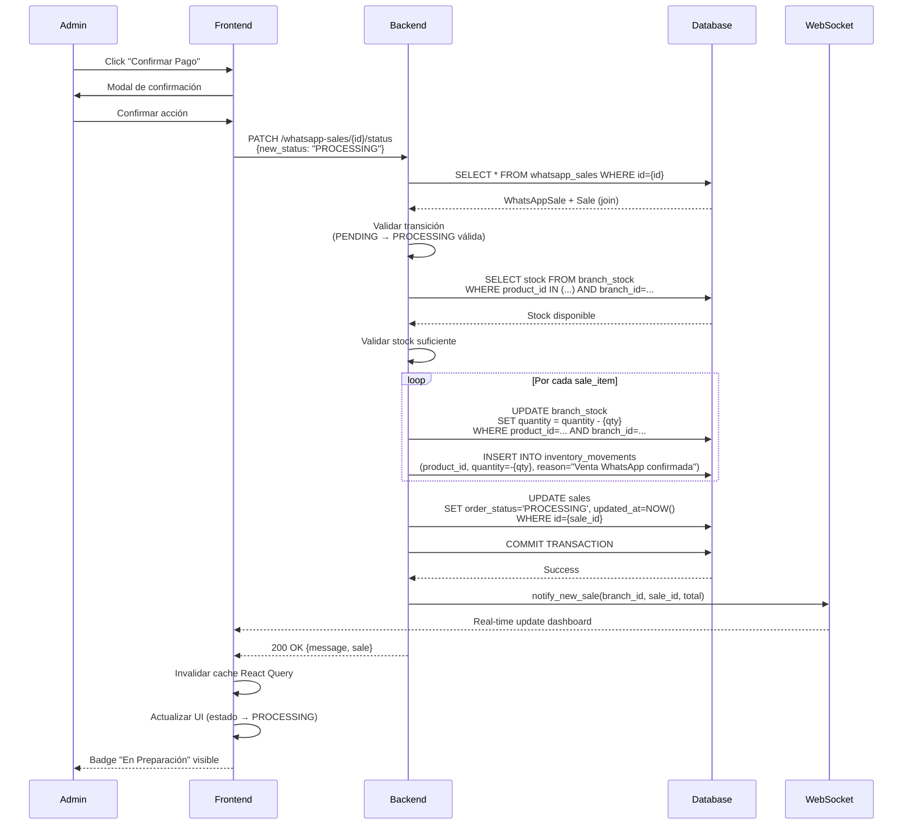
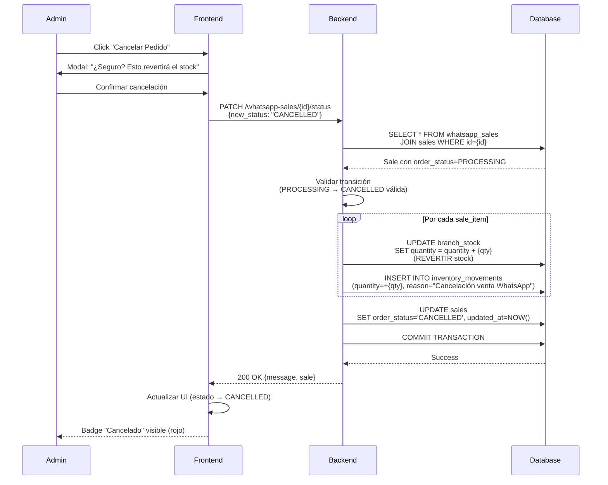

# Design: Optimizar Workflow de Ventas WhatsApp

**Relacionado con:** proposal.md  
**Arquitectura:** Full-stack (Backend + Frontend POS Admin)  
**Fecha:** 2026-03-03

---

## 🎯 Decisiones de Diseño

### Enfoque Elegido
**Enfoque:** Aprovechar el sistema de estados `OrderStatus` existente y agregar lógica de negocio automática (descuento de stock) en transiciones de estado. Eliminar duplicación manteniendo una única fuente de verdad (`Sale.order_status`).

**Componentes:**
1. **Backend:** Nuevo endpoint `PATCH /ecommerce-advanced/whatsapp-sales/{id}/status` con validación y automatización
2. **Backend:** Helper function `adjust_stock_for_sale()` para manejar stock de forma consistente
3. **Frontend:** Rediseño de UI en "Ventas WhatsApp" con botones contextuales por estado
4. **Frontend:** Eliminación de sección "Ventas" (duplicada y confusa)

### Rationale
**Por qué esta solución:**
- ✅ **Aprovecha arquitectura existente:** `OrderStatus` ya estaba diseñado para este flujo (líneas 175-285 en `backend/app/models/enums.py`)
- ✅ **Single Source of Truth:** `Sale.order_status` es la verdad, no duplicar estado en múltiples lugares
- ✅ **Minimal breaking changes:** Compatible hacia atrás (ventas antiguas siguen funcionando)
- ✅ **Reusa Repository Pattern:** `BranchStockRepository.adjust_stock()` ya existe
- ✅ **Consistente con Clean Architecture:** Lógica en Service layer, no en Controller
- ✅ **Auditable:** Cada cambio de stock genera `InventoryMovement` con razón descriptiva

### Trade-offs
| Aspecto | Trade-off | Justificación |
|---------|-----------|---------------|
| **Automatización** | Stock se descuenta automáticamente vs manual | Automático reduce errores humanos y es más rápido. Validación previa previene descuentos sin stock. |
| **UI Complexity** | Botones contextuales vs formulario único | Botones contextuales son más claros (acción específica por estado), aunque requieren más lógica condicional. |
| **Backward Compatibility** | Mantener ventas antiguas vs migración forzada | Mantener compatible: ventas antiguas siguen con flujo manual si es necesario. Solo nuevas ventas usan flujo optimizado. |
| **Eliminación de código** | Eliminar sección "Ventas" vs mantener ambas | Eliminar simplifica y fuerza adopción del flujo correcto. Si hay resistencia, se puede hacer feature flag temporal. |

---

## 🏗️ Arquitectura

### Componentes Afectados

#### Backend
**Archivos modificados:**
- `backend/routers/ecommerce_advanced.py` 
  - **Nuevo:** `PATCH /ecommerce-advanced/whatsapp-sales/{id}/status` (líneas ~600-700)
  - Importar `can_transition_order_status` de `app.models.enums`
  
- `backend/app/services/inventory_service.py` (si no existe, crear)
  - **Nuevo:** `adjust_stock_for_sale(db, sale, operation: Literal['deduct', 'revert'])`
  - Helper para manejar stock de productos con/sin talles
  
- `backend/app/schemas/whatsapp.py` (si es necesario)
  - **Nuevo:** `WhatsAppSaleStatusUpdate` (solo contiene `new_status: OrderStatus`)

**NO se modifica:**
- `backend/app/models/sales.py` - Modelo Sale ya tiene `order_status`
- `backend/app/models/whatsapp.py` - Modelo WhatsAppSale no necesita cambios
- `backend/database.py` - No requiere migración de BD

#### Frontend POS Admin
**Archivos modificados:**
- `frontend/pos-cesariel/features/ecommerce/components/WhatsAppSales.tsx`
  - Agregar columna de estado visual (badges con colores)
  - Agregar botones de acción contextuales según estado actual
  - Agregar modal de confirmación para acciones críticas
  
- `frontend/pos-cesariel/features/ecommerce/hooks/useWhatsAppSales.ts`
  - **Nuevo:** `updateSaleStatus(id, newStatus)` mutation
  - Invalidar cache de React Query después de update
  
- `frontend/pos-cesariel/features/ecommerce/api/ecommerceAdvancedApi.ts`
  - **Nuevo:** `updateWhatsAppSaleStatus(id, newStatus)` API call

**Archivos eliminados:**
- `frontend/pos-cesariel/features/ecommerce/components/EcommerceSales.tsx` (sección "Ventas")
- Actualizar navegación para remover link a "Ventas"

### Diagrama de Secuencia

#### Escenario: Confirmar Pago (PENDING → PROCESSING)



#### Escenario: Cancelar Orden (PROCESSING → CANCELLED)



### Modelo de Datos

**NO se requiere migración de base de datos.**

Usamos campos existentes:
- `Sale.order_status` (Enum: PENDING, PROCESSING, SHIPPED, DELIVERED, CANCELLED) - **YA EXISTE**
- `WhatsAppSale.sale_id` (FK a sales.id) - **YA EXISTE**
- `BranchStock.quantity` - **YA EXISTE**
- `InventoryMovement` - **YA EXISTE**

**Relaciones utilizadas:**
```
WhatsAppSale
├── sale_id (FK) → Sale
│   ├── order_status (ENUM OrderStatus)  ← El que modificamos
│   ├── sale_items (1:N) → SaleItem
│   │   ├── product_id (FK) → Product
│   │   ├── quantity (INT)
│   │   └── size (VARCHAR opcional)
│   └── branch_id (FK) → Branch
└── [metadata de WhatsApp: customer_whatsapp, shipping_method, etc.]

BranchStock (stock por sucursal)
├── product_id (FK)
├── branch_id (FK)
├── size_id (FK nullable)  ← Para productos con talles
└── quantity (INT)  ← Lo que modificamos

InventoryMovement (auditoría de stock)
├── product_id (FK)
├── branch_id (FK)
├── movement_type (ENUM: sale, adjustment, etc.)
├── quantity (INT)  ← Negativo = venta, Positivo = devolución
└── reason (TEXT)  ← "Venta WhatsApp #V-XXX confirmada"
```

---

## 📡 API Changes

### Nuevos Endpoints

#### `PATCH /ecommerce-advanced/whatsapp-sales/{id}/status`
**Descripción:** Actualiza el estado de una orden de WhatsApp y ejecuta lógica de negocio automática (descuento/reversión de stock, notificaciones).

**Path Parameters:**
- `id` (int): ID del registro WhatsAppSale

**Request Body:**
```json
{
  "new_status": "PROCESSING"
}
```

**Valores válidos de `new_status`:**
- `"PENDING"` - Orden creada (no debería usarse manualmente)
- `"PROCESSING"` - Pago confirmado (DESCUENTA STOCK)
- `"SHIPPED"` - Enviado al cliente
- `"DELIVERED"` - Entregado exitosamente (estado final)
- `"CANCELLED"` - Cancelado (REVIERTE STOCK si estaba en PROCESSING+)

**Response (200 OK):**
```json
{
  "message": "Estado actualizado a PROCESSING. Stock descontado correctamente.",
  "sale": {
    "id": 123,
    "sale_number": "E-20260303-042",
    "order_status": "PROCESSING",
    "total_amount": 15000.00,
    "customer_name": "Juan Pérez",
    "updated_at": "2026-03-03T14:30:00Z"
  },
  "stock_changes": [
    {
      "product_id": 10,
      "product_name": "Remera Negra",
      "size": "M",
      "quantity_adjusted": -2,
      "new_stock": 48
    }
  ]
}
```

**Errores:**
- `400 Bad Request`: 
  ```json
  {
    "detail": "Transición inválida: No se puede pasar de DELIVERED a PENDING"
  }
  ```
  
- `400 Bad Request` (stock insuficiente):
  ```json
  {
    "detail": "Stock insuficiente para confirmar venta. Producto 'Remera Negra' talle M: disponible 1, requerido 2"
  }
  ```
  
- `404 Not Found`:
  ```json
  {
    "detail": "Venta WhatsApp no encontrada"
  }
  ```
  
- `403 Forbidden`:
  ```json
  {
    "detail": "Requiere rol ADMIN o MANAGER"
  }
  ```

**Validaciones:**
1. WhatsAppSale existe
2. Sale asociada existe
3. Transición de estado es válida según `VALID_ORDER_TRANSITIONS`
4. Si transición es PENDING → PROCESSING: Stock suficiente para todos los items
5. Usuario tiene permisos (ADMIN o MANAGER)

**Efectos secundarios (automáticos):**

| Transición | Efecto en Stock | InventoryMovement | Notificación WebSocket |
|------------|-----------------|-------------------|------------------------|
| PENDING → PROCESSING | ✅ Descuenta (quantity negativo) | ✅ Crea con reason="Venta WhatsApp #... confirmada" | ✅ `notify_new_sale()` |
| PROCESSING → SHIPPED | ❌ Sin cambio | ❌ No crea | ❌ No notifica |
| SHIPPED → DELIVERED | ❌ Sin cambio | ❌ No crea | ❌ No notifica |
| PENDING → CANCELLED | ❌ Sin cambio (nunca se descontó) | ❌ No crea | ❌ No notifica |
| PROCESSING → CANCELLED | ✅ Revierte (quantity positivo) | ✅ Crea con reason="Cancelación venta WhatsApp #..." | ⚠️ Opcional: `notify_low_stock()` si queda bajo |
| SHIPPED → CANCELLED | ✅ Revierte (devolución) | ✅ Crea con reason="Devolución venta WhatsApp #..." | ⚠️ Opcional |

### Endpoints Modificados

#### `GET /ecommerce-advanced/whatsapp-sales`
**Cambios:**
- ✅ **Sin cambios en firma** (backward compatible)
- Response ahora incluye `order_status` en el objeto `sale` anidado (ya existía, no es breaking)

**Ejemplo response (sin cambios breaking):**
```json
[
  {
    "id": 1,
    "sale_id": 123,
    "customer_name": "Juan Pérez",
    "customer_whatsapp": "+5491112345678",
    "shipping_method": "delivery",
    "sale": {
      "id": 123,
      "sale_number": "E-20260303-042",
      "order_status": "PENDING",  ← Campo que usaremos en UI
      "total_amount": 15000.00,
      "created_at": "2026-03-03T10:00:00Z"
    }
  }
]
```

**Backward Compatibility:** ✅ Sí (no rompe clientes existentes)

---

## 🧩 Backend Implementation Details

### Nuevo Endpoint: `PATCH /ecommerce-advanced/whatsapp-sales/{id}/status`

**Ubicación:** `backend/routers/ecommerce_advanced.py` (agregar al final)

**Pseudocódigo:**
```python
from app.models.enums import OrderStatus, can_transition_order_status
from app.services.inventory_service import adjust_stock_for_sale
from websocket_manager import notify_new_sale

@router.patch("/whatsapp-sales/{id}/status")
def update_whatsapp_sale_status(
    id: int,
    status_update: WhatsAppSaleStatusUpdate,  # Schema: {new_status: OrderStatus}
    db: Session = Depends(get_db),
    current_user: User = Depends(require_manager_or_admin)
):
    # 1. Obtener WhatsAppSale + Sale (join)
    whatsapp_sale = db.query(WhatsAppSale).filter(WhatsAppSale.id == id).first()
    if not whatsapp_sale:
        raise HTTPException(404, "Venta WhatsApp no encontrada")
    
    sale = whatsapp_sale.sale
    current_status = sale.order_status
    new_status = status_update.new_status
    
    # 2. Validar transición
    if not can_transition_order_status(current_status, new_status):
        raise HTTPException(
            400, 
            f"Transición inválida: {current_status.value} → {new_status.value}"
        )
    
    # 3. Lógica de negocio según transición
    stock_changes = []
    
    if current_status == OrderStatus.PENDING and new_status == OrderStatus.PROCESSING:
        # CONFIRMAR PAGO → Descontar stock
        try:
            stock_changes = adjust_stock_for_sale(
                db=db,
                sale=sale,
                operation="deduct"  # Descuenta stock
            )
        except ValueError as e:
            # Stock insuficiente
            raise HTTPException(400, str(e))
        
        # Notificar nueva venta
        notify_new_sale(
            branch_id=sale.branch_id,
            sale_id=sale.id,
            sale_number=sale.sale_number,
            total_amount=float(sale.total_amount)
        )
    
    elif new_status == OrderStatus.CANCELLED and current_status in [OrderStatus.PROCESSING, OrderStatus.SHIPPED]:
        # CANCELAR → Revertir stock (solo si ya se había descontado)
        stock_changes = adjust_stock_for_sale(
            db=db,
            sale=sale,
            operation="revert"  # Revierte stock
        )
    
    # 4. Actualizar estado
    sale.order_status = new_status
    db.commit()
    db.refresh(sale)
    
    return {
        "message": f"Estado actualizado a {new_status.value}",
        "sale": sale,
        "stock_changes": stock_changes
    }
```

### Nuevo Service: `adjust_stock_for_sale()`

**Ubicación:** `backend/app/services/inventory_service.py` (crear si no existe)

**Firma:**
```python
from typing import Literal, List, Dict
from sqlalchemy.orm import Session
from app.models import Sale, SaleItem, BranchStock, ProductSize, InventoryMovement, Product

def adjust_stock_for_sale(
    db: Session,
    sale: Sale,
    operation: Literal["deduct", "revert"]
) -> List[Dict]:
    """
    Ajusta el stock para todos los items de una venta.
    
    Args:
        db: Sesión de base de datos
        sale: Venta con sale_items cargados
        operation: 
            - "deduct": Descuenta stock (PENDING → PROCESSING)
            - "revert": Revierte stock (cancelación)
    
    Returns:
        Lista de cambios de stock realizados:
        [
            {
                "product_id": 10,
                "product_name": "Remera Negra",
                "size": "M",
                "quantity_adjusted": -2,  # Negativo = descuento
                "new_stock": 48
            }
        ]
    
    Raises:
        ValueError: Si no hay stock suficiente (solo en operation="deduct")
    
    Effects:
        - Actualiza BranchStock.quantity o ProductSize.quantity
        - Crea InventoryMovement por cada item
    """
    multiplier = -1 if operation == "deduct" else +1
    stock_changes = []
    
    # 1. Validar stock disponible (solo si es deduct)
    if operation == "deduct":
        for item in sale.sale_items:
            product = item.product
            
            if product.has_sizes and item.size:
                # Producto con talle
                product_size = db.query(ProductSize).filter(
                    ProductSize.product_id == item.product_id,
                    ProductSize.branch_id == sale.branch_id,
                    ProductSize.size == item.size
                ).first()
                
                if not product_size or product_size.quantity < item.quantity:
                    raise ValueError(
                        f"Stock insuficiente para {product.name} talle {item.size}: "
                        f"disponible {product_size.quantity if product_size else 0}, "
                        f"requerido {item.quantity}"
                    )
            else:
                # Producto sin talle
                branch_stock = db.query(BranchStock).filter(
                    BranchStock.product_id == item.product_id,
                    BranchStock.branch_id == sale.branch_id
                ).first()
                
                if not branch_stock or branch_stock.quantity < item.quantity:
                    raise ValueError(
                        f"Stock insuficiente para {product.name}: "
                        f"disponible {branch_stock.quantity if branch_stock else 0}, "
                        f"requerido {item.quantity}"
                    )
    
    # 2. Ajustar stock
    for item in sale.sale_items:
        product = item.product
        quantity_change = item.quantity * multiplier
        
        if product.has_sizes and item.size:
            # Producto con talle
            product_size = db.query(ProductSize).filter(
                ProductSize.product_id == item.product_id,
                ProductSize.branch_id == sale.branch_id,
                ProductSize.size == item.size
            ).first()
            
            product_size.quantity += quantity_change
            new_stock = product_size.quantity
        else:
            # Producto sin talle
            branch_stock = db.query(BranchStock).filter(
                BranchStock.product_id == item.product_id,
                BranchStock.branch_id == sale.branch_id
            ).first()
            
            branch_stock.quantity += quantity_change
            new_stock = branch_stock.quantity
        
        # 3. Crear InventoryMovement para auditoría
        reason = (
            f"Venta WhatsApp #{sale.sale_number} confirmada"
            if operation == "deduct"
            else f"Cancelación venta WhatsApp #{sale.sale_number}"
        )
        
        movement = InventoryMovement(
            product_id=item.product_id,
            branch_id=sale.branch_id,
            quantity=quantity_change,  # Negativo si deduct, positivo si revert
            movement_type="sale" if operation == "deduct" else "adjustment",
            reason=reason,
            user_id=sale.user_id  # Puede ser None para ventas e-commerce
        )
        db.add(movement)
        
        # 4. Registrar cambio para respuesta
        stock_changes.append({
            "product_id": item.product_id,
            "product_name": product.name,
            "size": item.size,
            "quantity_adjusted": quantity_change,
            "new_stock": new_stock
        })
    
    return stock_changes
```

### Nuevo Schema: `WhatsAppSaleStatusUpdate`

**Ubicación:** `backend/app/schemas/whatsapp.py`

```python
from pydantic import BaseModel
from app.models.enums import OrderStatus

class WhatsAppSaleStatusUpdate(BaseModel):
    """
    Schema para actualizar el estado de una venta WhatsApp.
    """
    new_status: OrderStatus
    
    class Config:
        use_enum_values = True  # Permitir strings como "PROCESSING"
```

---

## 🎨 Frontend Implementation Details

### Componente: `WhatsAppSales.tsx` (Rediseñado)

**Ubicación:** `frontend/pos-cesariel/features/ecommerce/components/WhatsAppSales.tsx`

**Cambios principales:**
1. **Columna de estado** con badge visual
2. **Botones de acción** contextuales según `order_status`
3. **Modal de confirmación** para acciones críticas
4. **Loading states** durante actualización

**UI según estado:**

```tsx
// Mapeo de estados a colores de badge
const STATUS_CONFIG = {
  PENDING: { label: "Pendiente", color: "yellow", icon: "⏳" },
  PROCESSING: { label: "En Preparación", color: "blue", icon: "📦" },
  SHIPPED: { label: "Enviado", color: "purple", icon: "🚚" },
  DELIVERED: { label: "Entregado", color: "green", icon: "✅" },
  CANCELLED: { label: "Cancelado", color: "red", icon: "❌" }
};

// Botones según estado (pseudocódigo React)
function ActionButtons({ sale, onUpdateStatus }) {
  const { order_status } = sale.sale;
  
  if (order_status === 'PENDING') {
    return (
      <>
        <Button 
          variant="success"
          onClick={() => confirmAction('PROCESSING', 'Esto descontará el stock')}
        >
          ✅ Confirmar Pago
        </Button>
        <Button 
          variant="danger"
          onClick={() => confirmAction('CANCELLED', 'Se cancelará el pedido')}
        >
          ❌ Cancelar
        </Button>
      </>
    );
  }
  
  if (order_status === 'PROCESSING') {
    return (
      <>
        <Button onClick={() => onUpdateStatus(sale.id, 'SHIPPED')}>
          📦 Marcar como Enviado
        </Button>
        <Button 
          variant="danger"
          onClick={() => confirmAction('CANCELLED', 'Se revertirá el stock')}
        >
          ❌ Cancelar (Revertir Stock)
        </Button>
      </>
    );
  }
  
  if (order_status === 'SHIPPED') {
    return (
      <Button onClick={() => onUpdateStatus(sale.id, 'DELIVERED')}>
        ✅ Marcar como Entregado
      </Button>
    );
  }
  
  if (order_status === 'DELIVERED') {
    return <Badge variant="success">Entregado ✅</Badge>;
  }
  
  if (order_status === 'CANCELLED') {
    return <Badge variant="danger">Cancelado ❌</Badge>;
  }
}
```

### Hook: `useWhatsAppSales.ts` (Nueva Mutation)

**Ubicación:** `frontend/pos-cesariel/features/ecommerce/hooks/useWhatsAppSales.ts`

**Agregar mutation:**
```typescript
import { useMutation, useQueryClient } from '@tanstack/react-query';
import { updateWhatsAppSaleStatus } from '../api/ecommerceAdvancedApi';

export function useUpdateWhatsAppSaleStatus() {
  const queryClient = useQueryClient();
  
  return useMutation({
    mutationFn: ({ id, newStatus }: { id: number; newStatus: string }) =>
      updateWhatsAppSaleStatus(id, newStatus),
    
    onSuccess: (data, variables) => {
      // Invalidar cache para refrescar lista
      queryClient.invalidateQueries(['whatsapp-sales']);
      
      // Opcional: Update optimista
      queryClient.setQueryData(['whatsapp-sales'], (old: any) => {
        return old?.map((sale: any) =>
          sale.id === variables.id
            ? { ...sale, sale: { ...sale.sale, order_status: variables.newStatus } }
            : sale
        );
      });
      
      // Notificación de éxito
      toast.success(data.message);
    },
    
    onError: (error: any) => {
      // Manejo de errores
      const message = error.response?.data?.detail || 'Error al actualizar estado';
      toast.error(message);
    }
  });
}
```

### API Call: `ecommerceAdvancedApi.ts`

**Ubicación:** `frontend/pos-cesariel/features/ecommerce/api/ecommerceAdvancedApi.ts`

**Nueva función:**
```typescript
import apiClient from '@/shared/api/client';

export async function updateWhatsAppSaleStatus(
  id: number,
  newStatus: string
): Promise<{ message: string; sale: any; stock_changes: any[] }> {
  const response = await apiClient.patch(
    `/ecommerce-advanced/whatsapp-sales/${id}/status`,
    { new_status: newStatus }
  );
  return response.data;
}
```

---

## 🚀 Deployment Runbook

### Pre-requisitos
- [x] **NO requiere migración de BD** (usa campos existentes)
- [x] Tests backend pasando (pytest)
- [x] Tests frontend pasando (npm test)
- [x] Código en feature branch `feature/optimize-whatsapp-workflow`

### Pasos de Deployment

#### 1. Preparación
```bash
# Verificar tests backend
docker compose exec backend pytest -v

# Verificar tests frontend (si hay)
cd frontend/pos-cesariel && npm test

# Verificar linting
cd frontend/pos-cesariel && npm run lint
```

#### 2. NO hay Migración de Base de Datos
✅ **Skippear este paso** - No se requiere migración

#### 3. Deploy de Código
```bash
# Merge a main branch
git checkout main
git pull origin main
git merge feature/optimize-whatsapp-workflow
git push origin main

# Railway auto-deploy se activa
# Backend: https://backend-production-c20a.up.railway.app
# Frontend POS: https://frontend-pos-production.up.railway.app
```

#### 4. Verificación Post-Deploy
```bash
# Health check backend
curl https://backend-production-c20a.up.railway.app/docs

# Verificar nuevo endpoint existe
curl -X PATCH https://backend-production-c20a.up.railway.app/ecommerce-advanced/whatsapp-sales/1/status \
  -H "Authorization: Bearer <admin-token>" \
  -H "Content-Type: application/json" \
  -d '{"new_status": "PROCESSING"}' \
  -w "\nHTTP Status: %{http_code}\n"

# Debe responder 200 OK o 400/404 (si no existe venta 1)

# Verificar logs
railway logs -s backend --tail 100
railway logs -s frontend-pos --tail 100
```

#### 5. Smoke Testing en Producción
- [ ] **Login como Admin** en https://frontend-pos-production.up.railway.app
- [ ] **Navegar a módulo E-commerce → Ventas WhatsApp**
- [ ] **Verificar que aparecen ventas** con badges de estado
- [ ] **Click en "Confirmar Pago"** en una venta PENDING
  - Debe aparecer modal de confirmación
  - Confirmar y verificar que estado cambia a PROCESSING
  - Verificar en Dashboard que aparece la venta
  - Verificar en Inventario que el stock se descontó
- [ ] **Verificar sección "Ventas" eliminada** (no debe aparecer en navegación)

### Tiempo Estimado Total
**15 minutos** (sin migración de BD, deploy automático de Railway)

---

## 🔄 Rollback Procedure

### Detección de Problemas
**Señales de alerta:**
- [ ] Errores 500 en endpoint `/whatsapp-sales/{id}/status`
- [ ] Stock se descuenta incorrectamente (más de lo debido o no se descuenta)
- [ ] Cancelaciones no revierten stock
- [ ] Frontend muestra error al cargar "Ventas WhatsApp"
- [ ] Ventas confirmadas no aparecen en reportes

### Pasos de Rollback

#### Opción A: Rollback en Railway (rápido - SIN pérdida de datos)
```bash
railway rollback -s backend
railway rollback -s frontend-pos
```
**Tiempo:** ~2 minutos
**Efecto:** Vuelve a versión anterior del código, NO afecta BD

#### Opción B: Revert de Commit (más control)
```bash
git revert <commit-hash-backend>
git revert <commit-hash-frontend>
git push origin main
# Railway auto-deploy del revert
```
**Tiempo:** ~3-5 minutos

#### Opción C: Restaurar sección "Ventas" temporalmente (UI fallback)
```bash
# Si solo queremos restaurar la UI vieja sin tocar backend
git checkout HEAD~1 -- frontend/pos-cesariel/features/ecommerce/components/EcommerceSales.tsx
git checkout HEAD~1 -- frontend/pos-cesariel/features/ecommerce/components/Navigation.tsx
git commit -m "hotfix: Restaurar sección Ventas temporalmente"
git push origin main
```
**Tiempo:** ~5 minutos

### Verificación Post-Rollback
- [ ] Sistema vuelve a estado funcional (ventas WhatsApp se pueden ver)
- [ ] No hay errores en logs de Railway
- [ ] Admin puede gestionar ventas (aunque sea con flujo antiguo)

---

## 📊 Monitoring Checklist

### Métricas a Monitorear (primeras 24 horas)

#### Railway Metrics
- [ ] **CPU Usage:** < 60% (similar a baseline)
- [ ] **Memory Usage:** < 500 MB (no memory leaks)
- [ ] **Request Count:** Similar a baseline (no incremento anormal)
- [ ] **Response Time p95:** < 500ms (endpoint PATCH no debe ser lento)

#### Application Logs
```bash
# Monitorear errores
railway logs -s backend | grep ERROR

# Buscar errores específicos de stock
railway logs -s backend | grep "Stock insuficiente"

# Verificar que se están descontando stocks
railway logs -s backend | grep "Venta WhatsApp.*confirmada"
```

#### Base de Datos
```sql
-- Verificar que inventory_movements se está creando
SELECT COUNT(*) 
FROM inventory_movements 
WHERE reason LIKE '%Venta WhatsApp%' 
  AND created_at > NOW() - INTERVAL '1 day';

-- Verificar ventas en estado PROCESSING
SELECT COUNT(*) 
FROM sales 
WHERE order_status = 'PROCESSING' 
  AND sale_type = 'ECOMMERCE'
  AND created_at > NOW() - INTERVAL '1 day';

-- Verificar consistencia de stock (no debe haber negativos)
SELECT product_id, branch_id, quantity 
FROM branch_stock 
WHERE quantity < 0;
```

#### WebSocket Notifications
- [ ] Dashboard recibe notificación cuando se confirma venta
- [ ] Alertas de bajo stock se disparan si aplica

---

## 🧪 Testing Strategy

### Tests Unitarios Backend

**Archivo:** `backend/tests/unit/test_whatsapp_workflow.py` (nuevo)

```python
import pytest
from app.models import Sale, WhatsAppSale, SaleItem, BranchStock
from app.models.enums import OrderStatus
from app.services.inventory_service import adjust_stock_for_sale

def test_adjust_stock_deduct_success(db_session, test_sale_with_items):
    """Test que descuenta stock correctamente en PENDING → PROCESSING"""
    # Arrange
    sale = test_sale_with_items
    initial_stock = 100
    
    # Act
    stock_changes = adjust_stock_for_sale(db_session, sale, operation="deduct")
    
    # Assert
    assert len(stock_changes) > 0
    branch_stock = db_session.query(BranchStock).filter(
        BranchStock.product_id == sale.sale_items[0].product_id
    ).first()
    assert branch_stock.quantity == initial_stock - sale.sale_items[0].quantity

def test_adjust_stock_insufficient_raises_error(db_session, test_sale_with_items):
    """Test que lanza error si no hay stock suficiente"""
    # Arrange
    sale = test_sale_with_items
    # Reducir stock a menos de lo requerido
    branch_stock = db_session.query(BranchStock).first()
    branch_stock.quantity = 1  # Menos que quantity requerido
    db_session.commit()
    
    # Act & Assert
    with pytest.raises(ValueError, match="Stock insuficiente"):
        adjust_stock_for_sale(db_session, sale, operation="deduct")

def test_adjust_stock_revert_success(db_session, test_sale_with_items):
    """Test que revierte stock correctamente en cancelación"""
    # Arrange
    sale = test_sale_with_items
    initial_stock = 100
    # Primero descontar
    adjust_stock_for_sale(db_session, sale, operation="deduct")
    # Luego revertir
    
    # Act
    stock_changes = adjust_stock_for_sale(db_session, sale, operation="revert")
    
    # Assert
    branch_stock = db_session.query(BranchStock).first()
    assert branch_stock.quantity == initial_stock  # Volvió al valor original

def test_update_status_endpoint_pending_to_processing(client, auth_headers_admin, test_whatsapp_sale):
    """Test endpoint PATCH /whatsapp-sales/{id}/status PENDING → PROCESSING"""
    # Act
    response = client.patch(
        f"/ecommerce-advanced/whatsapp-sales/{test_whatsapp_sale.id}/status",
        json={"new_status": "PROCESSING"},
        headers=auth_headers_admin
    )
    
    # Assert
    assert response.status_code == 200
    data = response.json()
    assert data["sale"]["order_status"] == "PROCESSING"
    assert "stock_changes" in data

def test_update_status_invalid_transition_rejected(client, auth_headers_admin, test_whatsapp_sale):
    """Test que rechaza transición inválida (ej: DELIVERED → PENDING)"""
    # Arrange
    test_whatsapp_sale.sale.order_status = OrderStatus.DELIVERED
    
    # Act
    response = client.patch(
        f"/ecommerce-advanced/whatsapp-sales/{test_whatsapp_sale.id}/status",
        json={"new_status": "PENDING"},
        headers=auth_headers_admin
    )
    
    # Assert
    assert response.status_code == 400
    assert "Transición inválida" in response.json()["detail"]
```

### Tests Frontend (Opcional)

**Archivo:** `frontend/pos-cesariel/features/ecommerce/__tests__/WhatsAppSales.test.tsx`

```typescript
import { render, screen, fireEvent, waitFor } from '@testing-library/react';
import { QueryClient, QueryClientProvider } from '@tanstack/react-query';
import WhatsAppSales from '../components/WhatsAppSales';

test('muestra botón "Confirmar Pago" para ventas PENDING', () => {
  const mockSale = {
    id: 1,
    sale: { order_status: 'PENDING' }
  };
  
  render(<WhatsAppSales sales={[mockSale]} />);
  
  expect(screen.getByText(/Confirmar Pago/i)).toBeInTheDocument();
});

test('muestra modal de confirmación al hacer click en "Confirmar Pago"', async () => {
  const mockSale = {
    id: 1,
    sale: { order_status: 'PENDING' }
  };
  
  render(<WhatsAppSales sales={[mockSale]} />);
  
  fireEvent.click(screen.getByText(/Confirmar Pago/i));
  
  await waitFor(() => {
    expect(screen.getByText(/Esto descontará el stock/i)).toBeInTheDocument();
  });
});
```

---

## 📚 Documentation Updates

### Archivos a actualizar

1. **`CLAUDE.md`** (raíz del proyecto)
   - Sección "Common Workflows" → Agregar "Gestión de ventas WhatsApp"
   - Sección "API Endpoints Overview" → Agregar `PATCH /ecommerce-advanced/whatsapp-sales/{id}/status`

2. **`frontend/pos-cesariel/README.md`** (si existe)
   - Actualizar screenshot de módulo e-commerce (sin sección "Ventas")
   - Documentar nuevo flujo de confirmación de ventas WhatsApp

3. **`backend/routers/ecommerce_advanced.py`** (docstring del router)
   - Actualizar lista de endpoints disponibles

4. **Engram Memory** (persistent memory)
   - Guardar learning sobre optimización de workflow
   - Guardar decisión de arquitectura (aprovechar OrderStatus)

---

## 🎓 Key Learnings to Capture

Al finalizar la implementación, capturar estos learnings en Engram:

1. **Arquitectura:**
   - `OrderStatus` estaba diseñado para este flujo pero no se estaba usando correctamente
   - Single Source of Truth en `Sale.order_status` evita duplicación y bugs

2. **Stock Management:**
   - Siempre validar stock ANTES de confirmar transición de estado
   - Usar transacciones de BD para garantizar atomicidad (stock + estado)
   - `InventoryMovement` es crítico para auditoría (registrar razón descriptiva)

3. **UX:**
   - Botones contextuales por estado son más claros que formulario genérico
   - Modal de confirmación previene errores (especialmente en cancelaciones)
   - Loading states mejoran percepción de rapidez

4. **Testing:**
   - Tests de transiciones inválidas son esenciales (previenen bugs graves)
   - Mocking de WebSocket manager necesario para tests aislados

---

## ✅ Success Criteria Checklist

- [ ] Endpoint `PATCH /whatsapp-sales/{id}/status` responde correctamente
- [ ] Stock se descuenta automáticamente en PENDING → PROCESSING
- [ ] Stock se revierte automáticamente en cancelaciones
- [ ] `InventoryMovement` se crea con razón descriptiva
- [ ] Transiciones inválidas son rechazadas (400 Bad Request)
- [ ] Frontend muestra botones contextuales según estado
- [ ] Modal de confirmación aparece en acciones críticas
- [ ] Sección "Ventas" eliminada del módulo e-commerce
- [ ] Ventas confirmadas aparecen en Dashboard
- [ ] WebSocket notifica nueva venta al confirmar
- [ ] Tests backend pasando (100% de coverage en nuevo código)
- [ ] No hay regresiones en tests existentes
- [ ] Documentación actualizada en CLAUDE.md
- [ ] Learnings capturados en Engram

---

**FIN DEL DISEÑO TÉCNICO**

Próximo paso: Crear `specs.md` con escenarios detallados y luego `tasks.md` con checklist de implementación.
