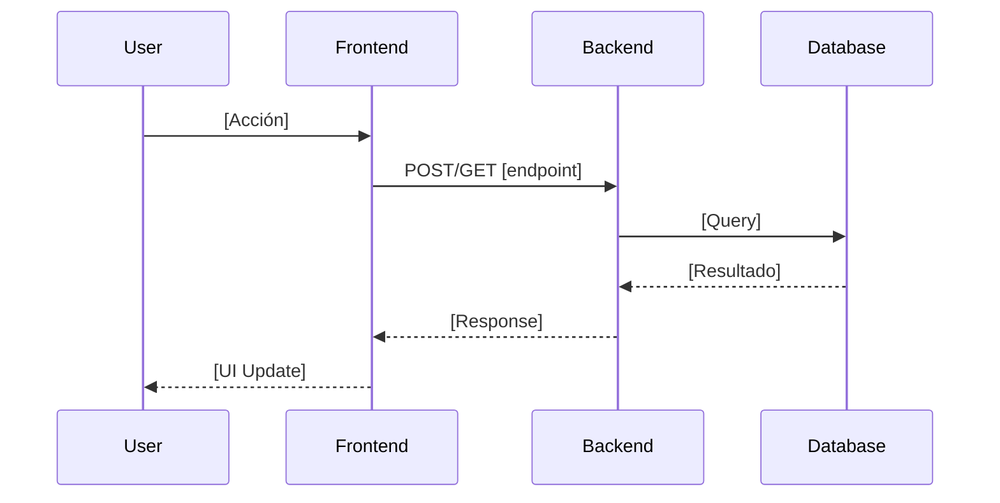

# Design: [Nombre del Cambio]

**Relacionado con:** [PROPOSAL_XXX.md]  
**Arquitectura:** [Backend | Frontend | Full-stack | Infraestructura]  
**Fecha:** [YYYY-MM-DD]

---

## 🎯 Decisiones de Diseño

### Enfoque Elegido
[Descripción del enfoque técnico elegido]

### Rationale
**Por qué esta solución:**
- [Razón 1: ej. "Mantiene Clean Architecture"]
- [Razón 2: ej. "Reutiliza Repository existente"]
- [Razón 3: ej. "Minimal impact en código existente"]

### Trade-offs
| Aspecto | Trade-off | Justificación |
|---------|-----------|---------------|
| Performance | [Ej: "Lazy loading vs eager loading"] | [Por qué se eligió X] |
| Complejidad | [Ej: "Simple vs robusto"] | [Por qué se eligió X] |

---

## 🏗️ Arquitectura

### Componentes Afectados

#### Backend
**Archivos modificados:**
- `backend/app/models/[model].py` - [Cambio]
- `backend/app/repositories/[repo].py` - [Cambio]
- `backend/app/services/[service].py` - [Cambio]
- `backend/routers/[router].py` - [Cambio]

**Nuevos archivos:**
- `backend/app/[path]/[file].py` - [Propósito]

#### Frontend POS (si aplica)
**Archivos modificados:**
- `frontend/pos-cesariel/features/[feature]/[file].tsx` - [Cambio]

#### E-commerce (si aplica)
**Archivos modificados:**
- `ecommerce/app/[path]/[file].tsx` - [Cambio]

### Diagrama de Secuencia



### Modelo de Datos

**Cambios en base de datos:**

#### Nueva tabla (si aplica)
```sql
CREATE TABLE [table_name] (
    id SERIAL PRIMARY KEY,
    [field1] VARCHAR(255) NOT NULL,
    [field2] INTEGER,
    created_at TIMESTAMP DEFAULT NOW(),
    updated_at TIMESTAMP DEFAULT NOW()
);
```

#### Alteración de tabla existente (si aplica)
```sql
ALTER TABLE [table_name]
ADD COLUMN [new_field] VARCHAR(255);
```

**Migración Alembic:**
```bash
# Crear migración
make migrate-create MSG="[descripción del cambio]"

# Archivo generado: backend/alembic/versions/[hash]_[description].py
```

---

## 📡 API Changes

### Nuevos Endpoints (si aplica)

#### `[METHOD] /api/[endpoint]`
**Descripción:** [Qué hace]

**Request:**
```json
{
  "field1": "value",
  "field2": 123
}
```

**Response (200 OK):**
```json
{
  "success": true,
  "data": {
    "id": 1,
    "field1": "value"
  }
}
```

**Errores:**
- `400 Bad Request`: [Cuando]
- `404 Not Found`: [Cuando]
- `500 Internal Server Error`: [Cuando]

### Endpoints Modificados (si aplica)

#### `[METHOD] /api/[endpoint]`
**Cambios:**
- [Cambio 1: ej. "Nuevo query param 'filter_by_date'"]
- [Cambio 2: ej. "Response incluye campo 'total_count'"]

**Backward Compatibility:** [Sí | No - Explicar breaking changes]

---

## 🚀 Deployment Runbook

### Pre-requisitos
- [ ] [Ej: "Backup de base de datos creado"]
- [ ] [Ej: "Variables de entorno configuradas en Railway"]
- [ ] [Ej: "Tests pasando en local"]

### Pasos de Deployment

#### 1. Preparación
```bash
# Backup de BD (si hay cambios de schema)
make backup-db

# Verificar tests
make test-backend
cd frontend/pos-cesariel && npm test
```

#### 2. Migración de Base de Datos (si aplica)
```bash
# En local primero
make migrate-upgrade

# Si funciona, aplicar en producción
railway run -s backend make migrate-upgrade
```

#### 3. Deploy de Código
```bash
# Merge a main branch
git checkout main
git merge feature/[branch-name]
git push origin main

# Railway auto-deploy se activa
# Monitorear: https://railway.app/project/[project-id]/deployments
```

#### 4. Verificación Post-Deploy
```bash
# Health check
curl https://backend-production-c20a.up.railway.app/health

# Verificar endpoint específico
curl -X GET https://backend-production-c20a.up.railway.app/api/[endpoint]

# Verificar logs
railway logs -s backend
```

#### 5. Smoke Testing en Producción
- [ ] [Test 1: ej. "Login funciona"]
- [ ] [Test 2: ej. "Crear producto funciona"]
- [ ] [Test 3: ej. "Venta POS funciona"]

### Tiempo Estimado Total
[X minutos]

---

## 🔄 Rollback Procedure

### Detección de Problemas
**Señales de alerta:**
- [ ] [Ej: "Errores 500 en logs"]
- [ ] [Ej: "CPU usage > 80%"]
- [ ] [Ej: "Feature X no funciona"]

### Pasos de Rollback

#### Opción A: Rollback en Railway (rápido)
```bash
railway rollback -s backend
railway rollback -s frontend-pos
railway rollback -s ecommerce
```
**Tiempo:** ~2 minutos

#### Opción B: Rollback de Migración de BD (si hubo)
```bash
railway run -s backend make migrate-downgrade
```
**Tiempo:** ~5 minutos

#### Opción C: Revert de Commit (más control)
```bash
git revert [commit-hash]
git push origin main
# Railway auto-deploy del revert
```
**Tiempo:** ~3 minutos

### Verificación Post-Rollback
- [ ] [Sistema vuelve a estado funcional]
- [ ] [No hay errores en logs]
- [ ] [Features críticas funcionan]

---

## 📊 Monitoring Checklist

### Métricas a Monitorear (primeras 24 horas)

#### Railway Metrics
- [ ] **CPU Usage:** [Esperado: < X%]
- [ ] **Memory Usage:** [Esperado: < X MB]
- [ ] **Request Count:** [Esperado: similar a baseline]
- [ ] **Response Time p95:** [Esperado: < X ms]

#### Application Logs
- [ ] **Error Rate:** [Esperado: < 0.1%]
- [ ] **Warning Count:** [Esperado: < X por hora]

#### Database
- [ ] **Query Latency:** [Esperado: < X ms]
- [ ] **Active Connections:** [Esperado: < X]

#### Business Metrics (si aplica)
- [ ] **Ventas procesadas:** [Esperado: similar a baseline]
- [ ] **Usuarios activos:** [Esperado: sin cambios]

### Alertas Configuradas
- [ ] [Alerta 1: ej. "Error rate > 1%"]
- [ ] [Alerta 2: ej. "Response time > 500ms"]

---

## 🧪 Testing Strategy

### Tests Unitarios
```bash
# Backend
pytest tests/unit/test_[feature].py -v

# Expected coverage: > 80%
```

### Tests de Integración
```bash
# Backend API
pytest tests/integration/test_[feature]_api.py -v
```

### Tests Manuales
- [ ] [Escenario 1: ej. "Usuario admin puede crear producto"]
- [ ] [Escenario 2: ej. "Vendedor puede procesar venta POS"]
- [ ] [Escenario 3: ej. "Cliente puede comprar en e-commerce"]

---

## 📝 Performance Considerations

### Impacto Esperado en Performance

| Métrica | Antes | Después | Cambio |
|---------|-------|---------|--------|
| Response Time | [X ms] | [Y ms] | [±Z%] |
| Database Queries | [X queries] | [Y queries] | [±Z%] |
| Memory Usage | [X MB] | [Y MB] | [±Z%] |

### Optimizaciones Aplicadas
- [Optimización 1: ej. "Batch query en lugar de N+1"]
- [Optimización 2: ej. "Caché de configuración"]

---

## 🔐 Security Considerations

### Vulnerabilidades Mitigadas
- [Vulnerabilidad 1: ej. "SQL Injection"]
- [Vulnerabilidad 2: ej. "XSS"]

### Validaciones Agregadas
- [Validación 1: ej. "Input sanitization"]
- [Validación 2: ej. "Role-based access control"]

---

## 📚 Documentation Updates

### Archivos de Documentación a Actualizar
- [ ] `CLAUDE.md` - [Sección X actualizada]
- [ ] `backend/README.md` - [Si hay nuevos endpoints]
- [ ] `frontend/README.md` - [Si hay nuevos features]

---

## ✅ Checklist Final

### Pre-Deploy
- [ ] Tests unitarios pasando
- [ ] Tests de integración pasando
- [ ] Linting pasando (pylint, eslint)
- [ ] Migraciones revisadas
- [ ] Variables de entorno configuradas
- [ ] Backup de BD creado

### Post-Deploy
- [ ] Health check OK
- [ ] Smoke tests OK
- [ ] Logs sin errores críticos
- [ ] Métricas dentro de lo esperado
- [ ] Features funcionando en producción
- [ ] Cliente notificado (si aplica)

### Post-Mortem (48 horas después)
- [ ] Métricas revisadas
- [ ] Feedback de usuarios recopilado
- [ ] Learnings capturados en Engram
- [ ] Documentación actualizada
